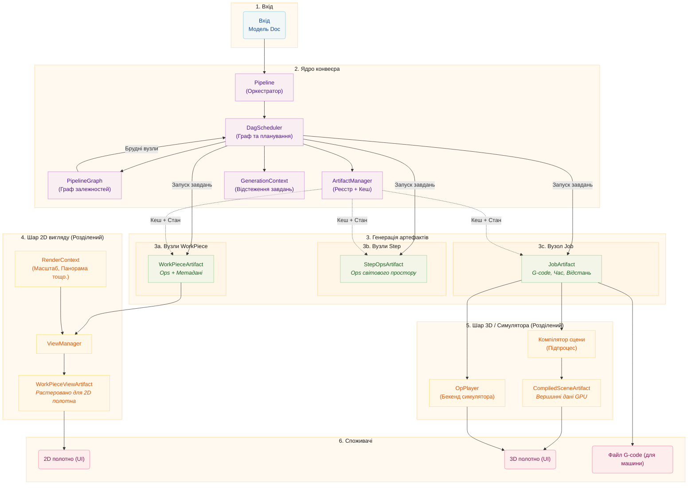

# Архітектура конвеєра

Цей документ описує архітектуру конвеєра, яка використовує орієнтований ациклічний
граф (DAG) для оркестрації генерації артефактів. Конвеєр трансформує сирі
дані дизайну у фінальні виходи для візуалізації та виробництва, з
плануванням з урахуванням залежностей та ефективним кешуванням артефактів.

```mermaid
graph TD
    subgraph Input["1. Вхід"]
        InputNode("Вхід<br/>Модель Doc")
    end

    subgraph PipelineCore["2. Ядро конвеєра"]
        Pipeline["Pipeline<br/>(Оркестратор)"]
        DAG["DagScheduler<br/>(Граф та планування)"]
        Graph["PipelineGraph<br/>(Граф залежностей)"]
        AM["ArtifactManager<br/>(Реєстр + Кеш)"]
        GC["GenerationContext<br/>(Відстеження завдань)"]
    end

    subgraph ArtifactGen["3. Генерація артефактів"]
        subgraph WorkPieceNodes["3a. Вузли WorkPiece"]
            WP["WorkPieceArtifact<br/><i>Ops + Метадані</i>"]
        end

        subgraph StepNodes["3b. Вузли Step"]
            SO["StepOpsArtifact<br/><i>Ops світового простору</i>"]
        end

        subgraph JobNode["3c. Вузол Job"]
            JA["JobArtifact<br/><i>G-code, Час, Відстань</i>"]
        end
    end

    subgraph View2D["4. Шар 2D вигляду (Розділений)"]
        VM["ViewManager"]
        RC["RenderContext<br/>(Масштаб, Панорама тощо.)"]
        WV["WorkPieceViewArtifact<br/><i>Растеровано для 2D полотна</i>"]
    end

    subgraph View3D["5. Шар 3D / Симулятора (Розділений)"]
        SC["Компілятор сцени<br/>(Підпроцес)"]
        CS["CompiledSceneArtifact<br/><i>Вершинні дані GPU</i>"]
        OP["OpPlayer<br/>(Бекенд симулятора)"]
    end

    subgraph Consumers["6. Споживачі"]
        Vis2D("2D полотно (UI)")
        Vis3D("3D полотно (UI)")
        File("Файл G-code (для машини)")
    end

    InputNode --> Pipeline
    Pipeline --> DAG
    DAG --> Graph
    DAG --> AM
    DAG --> GC

    Graph -->|"Брудні вузли"| DAG
    DAG -->|"Запуск завдань"| WP
    DAG -->|"Запуск завдань"| SO
    DAG -->|"Запуск завдань"| JA

    AM -.->|"Кеш + Стан"| WP
    AM -.->|"Кеш + Стан"| SO
    AM -.->|"Кеш + Стан"| JA

    WP --> VM
    JA --> SC
    JA --> OP
    JA --> File

    RC --> VM
    VM --> WV
    WV --> Vis2D

    SC --> CS
    CS --> Vis3D
    OP --> Vis3D

    classDef clusterBox fill:#fff3e080,stroke:#ffb74d80,stroke-width:1px,color:#1a1a1a
    classDef inputNode fill:#e1f5fe80,stroke:#03a9f480,color:#0d47a1
    classDef coreNode fill:#f3e5f580,stroke:#9c27b080,color:#4a148c
    classDef artifactNode fill:#e8f5e980,stroke:#4caf5080,color:#1b5e20
    classDef viewNode fill:#fff8e180,stroke:#ffc10780,color:#e65100
    classDef consumerNode fill:#fce4ec80,stroke:#e91e6380,color:#880e4f
    class Input,PipelineCore,ArtifactGen,WorkPieceNodes,StepNodes,JobNode,View2D,View3D,Consumers clusterBox
    class InputNode inputNode
    class Pipeline,DAG,Graph,AM,GC coreNode
    class WP,SO,JA artifactNode
    class VM,RC,WV,SC,CS,OP viewNode
    class Vis2D,Vis3D,File consumerNode
```

# Основні концепції

## Вузли артефактів та граф залежностей

Конвеєр використовує **орієнтований ациклічний граф (DAG)** для моделювання артефактів та
їхніх залежностей. Кожен артефакт представлений як `ArtifactNode` у
графі.

### ArtifactNode

Кожен вузол містить:

- **ArtifactKey**: Унікальний ідентифікатор, що складається з ID та типу групи
  (`workpiece`, `step`, `job` або `view`)
- **Залежності**: Список вузлів, від яких залежить цей вузол (нащадки)
- **Залежні**: Список вузлів, що залежать від цього вузла (предки)

Вузли не зберігають стан безпосередньо. Замість цього вони делегують читання та
запис стану до `ArtifactManager`, який веде реєстр усіх артефактів
та їхніх станів.

### Стани вузлів

Вузли проходять через п'ять станів:

| Стан        | Опис                                                       |
| ------------ | ---------------------------------------------------------- |
| `DIRTY`      | Артефакт потребує (пере)генерації                          |
| `PROCESSING` | Завдання наразі генерує артефакт                           |
| `VALID`      | Артефакт готовий та актуальний                             |
| `ERROR`      | Генерація не вдалася                                       |
| `CANCELLED`  | Генерацію скасовано; буде повторено, якщо все ще потрібно  |

Коли вузол позначається як брудний, всі його залежні також позначаються брудними,
поширюючи інвалідацію вгору по графу.

### PipelineGraph

`PipelineGraph` будується з моделі Doc і містить:

- Один вузол для кожної пари `(WorkPiece, Step)`
- Один вузол для кожного Step
- Один вузол для Job

Залежності встановлюються:

- Steps залежать від вузлів пар `(WorkPiece, Step)`
- Job залежить від всіх Steps

## DagScheduler

`DagScheduler` - це центральний оркестратор конвеєра. Він володіє
`PipelineGraph` і відповідає за:

1. **Побудову графа** з моделі Doc
2. **Виявлення готових вузлів** (DIRTY з усіма VALID залежностями)
3. **Запуск завдань** через відповідні стадії конвеєра
4. **Відстеження стану** через процес генерації
5. **Повідомлення споживачів** коли артефакти готові

Планувальник працює з ID генерацій щоб відстежувати, які артефакти належать
до якої версії документа, дозволяючи повторне використання дійсних артефактів між генераціями.

Ключова поведінка:

- Коли граф побудовано, планувальник синхронізує стани вузлів з
  менеджером артефактів щоб виявити кешовані артефакти, які можна повторно використати
- Артефакти з попередньої генерації можуть бути повторно використані, якщо вони залишаються дійсними
- Інвалідації відстежуються навіть перед перебудовою графа і повторно застосовуються після
- Планувальник делегує фактичне створення завдань стадіям, але контролює
  **коли** завдання запускаються на основі готовності залежностей

## ArtifactManager

`ArtifactManager` слугує як кеш та єдине джерело істини
для стану артефактів. Він:

- Зберігає та отримує дескриптори артефактів через **реєстр** (ключований за
  `ArtifactKey` + ID генерації)
- Відстежує стан (`DIRTY`, `VALID`, `ERROR` тощо) у записах реєстру
- Керує підрахунком посилань для очищення спільної пам'яті
- Обробляє життєвий цикл (створення, утримання, звільнення, видалення)
- Надає менеджери контексту для безпечного усиновлення, завершення,
  обробки помилок та скасування артефактів

## GenerationContext

Кожен цикл узгодження створює `GenerationContext`, який відстежує всі
активні завдання для цієї генерації. Він гарантує, що ресурси спільної пам'яті
залишаються дійсними, поки всі виконувані завдання для генерації не завершаться,
навіть якщо новіша генерація вже розпочалась. Коли контекст заміщено
і всі його завдання завершено, він автоматично звільняє свої ресурси.

## Життєвий цикл спільної пам'яті

Артефакти зберігаються у спільній пам'яті (`multiprocessing.shared_memory`) для
ефективної міжпроцесної комунікації між робочими процесами та основним
процесом. `ArtifactStore` керує життєвим циклом цих блоків пам'яті.

### Патерни володіння

**Локальне володіння:** Створюючий процес володіє дескриптором і звільняє його
коли завершено. Це найпростіший патерн.

**Передача між процесами:** Робочий створює артефакт, надсилає його до
основного процесу через IPC, і передає володіння. Робочий "забуває"
дескриптор (закриває його файловий дескриптор без відключення пам'яті), тоді як
основний процес "усиновлює" його і стає відповідальним за кінцеве звільнення.

### Виявлення застарілих артефактів

Механізм `StaleGenerationError` запобігає усиновленню артефактів із заміщених
поколінь. Коли розпочато нову генерацію, менеджер виявляє застарілі артефакти
під час усиновлення та мовчки відкидає їх.

## Стадії конвеєра

Стадії конвеєра (`WorkPiecePipelineStage`, `StepPipelineStage`,
`JobPipelineStage`) відповідають за **механіку** виконання завдань:

- Вони створюють та реєструють завдання підпроцесів через `TaskManager`
- Вони обробляють події завдань (прогресивні фрагменти, проміжні результати)
- Вони керують усиновленням артефактів та кешуванням після завершення завдання
- Вони емітять сигнали для повідомлення конвеєра про зміни стану

**DagScheduler** вирішує **коли** запускати кожну стадію, але стадії
обробляють фактичне породження підпроцесів, обробку подій та
усиновлення результатів.

## Стратегія інвалідації

Інвалідація викликається змінами в моделі Doc з різними стратегіями
залежно від того, що змінилося:

| Тип зміни               | Поведінка                                                                                        |
| ------------------------ | ------------------------------------------------------------------------------------------------ |
| Геометрія/параметри      | Пари деталь-крок інвалідуються, каскадуючи до кроків та завдання                                 |
| Позиція/обертання        | Кроки інвалідуються напряму (каскадуючи до завдання); деталі пропускаються за винятком чутливих до позиції |
| Зміна розміру            | Як геометрія: повний каскад від пар деталь-крок вгору                                            |
| Конфігурація машини      | Усі артефакти примусово інвалідуються для всіх генерацій                                         |

Кроки, чутливі до позиції (наприклад, з увімкненим обрізанням по заготівці),
викликають інвалідацію деталей навіть для чистих змін позиції.

# Детальний розбір

## Вхід

Процес починається з **Моделі Doc**, яка містить:

- **WorkPieces:** Окремі елементи дизайну (SVG, зображення) розміщені на полотні
- **Steps:** Інструкції обробки (Contour, Raster тощо) з налаштуваннями
- **Layers:** Групування деталей, кожна з власним робочим процесом

## Ядро конвеєра

### Pipeline (Оркестратор)

Клас `Pipeline` - це високорівневий диригент, який:

- Слухає модель Doc на зміни через сигнали
- **Дебажить** зміни (затримка узгодження 200мс, затримка видалення 50мс)
- Координує з DagScheduler для тригера регенерації
- Керує загальним станом обробки та виявленням зайнятості
- Підтримує **паузу/відновлення** для пакетних операцій
- Підтримує **ручний режим** (`auto_pipeline=False`), де перерахунок
  запускається явно, а не автоматично
- З'єднує сигнали між компонентами та передає їх споживачам

### DagScheduler

`DagScheduler`:

- Будує та підтримує `PipelineGraph`
- Виявляє вузли, готові до обробки
- Запускає завдання через методи `launch_task()` стадій
- Відстежує переходи станів вузлів через реєстр
- Емітує сигнали коли артефакти готові

### ArtifactManager

`ArtifactManager`:

- Веде **реєстр** об'єктів `LedgerEntry`, кожен з яких відстежує дескриптор,
  ID генерації та стан вузла
- Кешує дескриптори артефактів у спільній пам'яті
- Керує підрахунком посилань для очищення
- Надає пошук за ArtifactKey та ID генерації
- Видаляє застарілі генерації для підтримки реєстру в чистоті

### GenerationContext

Кожне узгодження створює новий `GenerationContext`, який:

- Відстежує активні завдання через ключі з підрахунком посилань
- Володіє ресурсами спільної пам'яті для своєї генерації
- Автоматично завершується коли заміщено і всі завдання виконано

## Генерація артефактів

### WorkPieceArtifacts

Генеруються для кожної комбінації `(WorkPiece, Step)`. Містять:

- Інструментальні шляхи (`Ops`) у локальній системі координат деталі
- Прапор масштабованості та вихідні розміри для незалежних від роздільної здатності ops
- Систему координат та метадані генерації

Послідовність обробки:

1. **Продюсер:** Створює сирі інструментальні шляхи (`Ops`) з даних деталі
2. **Трансформери:** Модифікації на рівні деталі, застосовані в впорядкованих фазах
   (Удосконалення геометрії → Переривання шляху → Постобробка)

Великі растрові деталі обробляються інкрементально фрагментами, забезпечуючи
прогресивний візуальний зворотний зв'язок під час генерації.

### StepOpsArtifacts

Генеруються для кожного Step, споживаючи всі пов'язані WorkPieceArtifacts:

- Комбіновані Ops для всіх деталей у координатах світового простору
- Застосовані трансформери на рівні кроку (Optimize, Multi-Pass тощо)

### JobArtifact

Генерується за запитом коли потрібен G-code, споживаючи всі StepOpsArtifacts:

- Фінальний машинний код (G-code або специфічний для драйвера формат)
- Повні ops для симуляції та відтворення
- Високоточна оцінка часу та загальна відстань
- Ops з_rotary-відображенням для 3D перегляду

## Шар 2D вигляду (Розділений)

`ViewManager` **розв'язаний** з конвеєра даних. Він обробляє
рендеринг для 2D полотна на основі стану UI:

### RenderContext

Містить поточні параметри вигляду:

- Пікселів на міліметр (рівень масштабування)
- Зсув вікна перегляду (панорама)
- Опції відображення (показувати холості переміщення тощо.)

### WorkPieceViewArtifacts

ViewManager створює `WorkPieceViewArtifacts`, які:

- Растеризують WorkPieceArtifacts у простір екрану
- Застосовують поточний RenderContext
- Кешуються та оновлюються коли контекст або джерело змінюється

### Життєвий цикл

1. ViewManager відстежує дескриптори вихідних `WorkPieceArtifact`
2. Коли контекст рендерингу змінюється, ViewManager тригерить повторний рендеринг
3. Коли вихідний артефакт змінюється, ViewManager тригерить повторний рендеринг
4. Повторний рендеринг дроселюється (інтервал 33мс) з обмеженням паралельності
5. Прогресивне зшивання фрагментів забезпечує інкрементальні візуальні оновлення

ViewManager індексує вигляди за `(workpiece_uid, step_uid)` щоб підтримувати
візуалізацію проміжних станів деталі через кілька кроків.

## Шар 3D / Симулятора (Розділений)

Система 3D візуалізації та симуляції **розв'язана** з конвеєра
даних, дотримуючись подібного патерну до ViewManager. Вона складається з:

- **Компілятора сцени**, що працює у підпроцесі для конвертації `JobArtifact`
  ops у вершинні дані, готові для GPU
- **OpPlayer**, що відтворює ops завдання для симуляції роботи машини
  в реальному часі з елементами керування відтворенням

Обидва споживають `JobArtifact`, створений стадією завдання конвеєра.

### CompiledSceneArtifact

Компілятор сцени створює `CompiledSceneArtifact`, що містить:

- **Шари вершин:** Буфери вершин з живленням/холостим ходом/нульовою потужністю з
  зсувами на рівні команд для прогресивного відкриття
- **Шари текстур:** Растеровані карти потужності рядків сканування для перегляду гравіювання
- **Шари накладання:** Сегменти потужності рядків сканування для підсвічування в реальному часі
- Підтримка rotary-геометрії (обгорнутого циліндра)

### Конвеєр компіляції

1. Canvas3D слухає сигнали `job_generation_finished`
2. Коли нове завдання готове, він планує компіляцію сцени у підпроцесі
3. Підпроцес читає `JobArtifact` зі спільної пам'яті та компілює
   ops у вершинні дані GPU
4. Скомпільована сцена усиновлюється назад у спільну пам'ять та завантажується у
   рендерери GPU

### OpPlayer (Бекенд симулятора)

`OpPlayer` проходить через ops завдання команда за командою, підтримуючи
`MachineState`, який відстежує позицію, стан лазера та допоміжні осі.
Це керує:

- Відтворенням на 3D полотні (прогресивне відкриття інструментального шляху)
- Позицією головки машини та візуалізацією лазерного променя
- Покроковим виконанням команд для повзунка відтворення

## Споживачі

| Споживач   | Використовує               | Призначення                                      |
| ---------- | -------------------------- | ------------------------------------------------ |
| 2D полотно | WorkPieceViewArtifacts     | Рендерить деталі у просторі екрану               |
| 3D полотно | CompiledSceneArtifact      | Рендерить повне завдання у 3D з відтворенням     |
| Машина     | JobArtifact (машинний код) | Виробничий вивід                                 |

# Ключові архітектурні рішення

1. **Планування на основі DAG:** Замість послідовних стадій, артефакти
   генеруються коли їхні залежності стають доступними, забезпечуючи паралелізм.

2. **Стан на основі реєстру:** Стан вузла відстежується у записах реєстру
   ArtifactManager, а не у самих вузлах графа, забезпечуючи єдине
   джерело істини як для стану, так і для зберігання дескрипторів.

3. **Розділення шару вигляду:** Як 2D полотно (ViewManager), так і 3D
   полотно (Компілятор сцени) розв'язані з конвеєра даних. Кожен
   виконує власний рендеринг на основі підпроцесів і керується сигналами
   конвеєра, а не є частиною DAG.

4. **ID генерацій:** Артефакти відстежуються з ID генерацій, дозволяючи
   ефективне повторне використання між версіями документа та виявлення застарілих артефактів.

5. **Централізована оркестрація:** DagScheduler - єдина точка
   контролю для планування завдань; стадії обробляють механіку виконання.

6. **Ізоляція GenerationContext:** Кожна генерація має власний контекст,
   гарантуючи, що ресурси залишаються активними до завершення всіх виконуваних завдань.

7. **Відстеження інвалідації:** Ключі, позначені брудними перед перебудовою графа,
   зберігаються і повторно застосовуються після перебудови.

8. **Дебажене узгодження:** Зміни групуються з налаштовуваними
   затримками щоб уникнути надмірних циклів конвеєра під час швидкого редагування.
