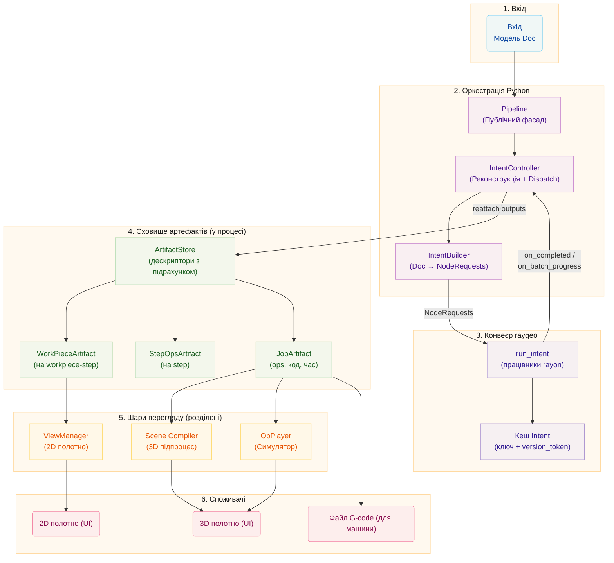

# Архітектура конвеєра

Цей документ описує конвеєр, який перетворює модель `Doc` на
виконуваний машиною G-code. Починаючи з переписування 1.9.0, конвеєр
побудовано на **інтентах raygeo**: декларативному описі роботи, яку
має виконати сторона Rust, у поєднанні з тонким шаром оркестрації
Python та сховищем артефактів у процесі з підрахунком посилань.

Попередній багатопроцесорний DAG (`DagScheduler`, `PipelineGraph`,
`ArtifactManager`, `GenerationContext`, `WorkPiecePipelineStage`)
було видалено. Цей документ описує лише активну архітектуру.

```mermaid
graph TD
    subgraph Input["1. Вхід"]
        InputNode("Вхід<br/>Модель Doc")
    end

    subgraph PythonOrchestrator["2. Оркестрація Python"]
        Pipeline["Pipeline<br/>(Публічний фасад)"]
        IC["IntentController<br/>(Реконструкція + Dispatch)"]
        IB["IntentBuilder<br/>(Doc &rarr; NodeRequests)"]
    end

    subgraph Raygeo["3. Конвеєр raygeo"]
        RI["run_intent<br/>(працівники rayon)"]
        Cache["Кеш Intent<br/>(ключ + version_token)"]
    end

    subgraph Artifacts["4. Сховище артефактів (у процесі)"]
        Store["ArtifactStore<br/>(дескриптори з підрахунком)"]
        WP["WorkPieceArtifact<br/>(на workpiece-step)"]
        SO["StepOpsArtifact<br/>(на step)"]
        JA["JobArtifact<br/>(ops, код, час)"]
    end

    subgraph View["5. Шари перегляду (розділені)"]
        VM["ViewManager<br/>(2D полотно)"]
        SC["Scene Compiler<br/>(3D підпроцес)"]
        OP["OpPlayer<br/>(Симулятор)"]
    end

    subgraph Consumers["6. Споживачі"]
        Vis2D("2D полотно (UI)")
        Vis3D("3D полотно (UI)")
        File("Файл G-code (для машини)")
    end

    InputNode --> Pipeline
    Pipeline --> IC
    IC --> IB
    IB -->|"NodeRequests"| RI
    RI -->|"on_completed /<br/>on_batch_progress"| IC
    RI --> Cache
    IC -->|"reattach outputs"| Store
    Store --> WP
    Store --> SO
    Store --> JA

    WP --> VM
    JA --> SC
    JA --> OP
    JA --> File

    VM --> Vis2D
    SC --> Vis3D
    OP --> Vis3D

    classDef clusterBox fill:#fff3e080,stroke:#ffb74d80,stroke-width:1px,color:#1a1a1a
    classDef inputNode fill:#e1f5fe80,stroke:#03a9f480,color:#0d47a1
    classDef pyNode fill:#f3e5f580,stroke:#9c27b080,color:#4a148c
    classDef raygeoNode fill:#ede7f680,stroke:#5e35b180,color:#311b92
    classDef artifactNode fill:#e8f5e980,stroke:#4caf5080,color:#1b5e20
    classDef viewNode fill:#fff8e180,stroke:#ffc10780,color:#e65100
    classDef consumerNode fill:#fce4ec80,stroke:#e91e6380,color:#880e4f
    class Input,PythonOrchestrator,Raygeo,Artifacts,View,Consumers clusterBox
    class InputNode inputNode
    class Pipeline,IC,IB pyNode
    class RI,Cache raygeoNode
    class Store,WP,SO,JA artifactNode
    class VM,SC,OP viewNode
    class Vis2D,Vis3D,File consumerNode
```

# Основні концепції

## Pipeline (публічний фасад)

`rayforge/pipeline/pipeline.py:40` — клас, з яким спілкується решта
застосунку. `DocEditor`, `ViewManager`, віджети UI та тестовий код
мають залежати лише від `Pipeline`. `IntentController` та
`IntentBuilder` є деталями реалізації фасаду і можуть змінюватися без
попередження.

`Pipeline` володіє інтеграцією `ArtifactStore`: він перекладає
необроблені вихідні дані raygeo, що надходять від його внутрішнього
`IntentController`, у дескриптори артефактів з підрахунком посилань,
які споживають UI та шляхи експорту, і надає поверхню
сигналів/властивостей, яку очікує решта застосунку (стан зайнятості,
пауза/відновлення, перерахунок, зміни машини).

Ключові сигнали, що ретранслюються фасадом:

| Сигнал                     | Значення                                                     |
| -------------------------- | ------------------------------------------------------------ |
| `processing_state_changed` | Переходи зайнятий/вільний                                    |
| `workpiece_artifact_ready` | Опубліковано дескриптор `WorkPieceArtifact`                  |
| `job_generation_finished`  | Дескриптор `JobArtifact` (G-code + ops + оцінки) готовий     |
| `job_time_updated`         | Агрегована оцінка часу змінена під час перебудови            |
| `data_stale`               | Перебудову запитано, але вона призупинена або ручний режим   |
| `visual_chunk_available`   | Прогресивний фрагмент растру для інкрементальних оновлень UI |

## IntentController

`rayforge/pipeline/intent_controller.py:108` — володіє `Intent`
raygeo та життєвим циклом перебудови. Він слухає ті самі спливливі
сигнали Doc, що й legacy-конвеєр (`descendant_updated`,
`descendant_transform_changed`, `descendant_added`,
`descendant_removed`, `job_assembly_invalidated`) і перебудовує
`Intent` raygeo щоразу, коли документ змінюється.

При кожній перебудові з дебаунсом (200 мс `REBUILD_DEBOUNCE_MS`):

1. `IntentBuilder` викликається для створення свіжого списку
   об'єктів `NodeRequest` з поточного `Doc`.
2. Новий список загортається в `Intent` raygeo через
   `create_intent_from_nodes`.
3. `Intent.update` порівнює попередній intent з новим, використовуючи
   `version_token` на вузол, та видаляє застарілі записи кешу в
   спільному `Pipeline` raygeo.
4. Коли `dispatch=True`, новий intent також виконується через
   `run_intent`; зворотний виклик `on_completed` виконує фільтр
   епохи (відкидає результати, чий `generation_id` старший за
   поточне покоління контролера), а потім маршалює повторне
   прикріплення DOM назад до головного потоку застосунку через
   спільний менеджер завдань.
5. Зворотний виклик `on_batch_progress` передає агрегований прогрес
   слухачам через `progress_changed` (маршалізований до головного
   потоку, щоб обробники сигналів ніколи не виконувалися на
   працівнику rayon).

Мапа `_key_to_item` контролера (перебудовується при кожному
успішному виклику `IntentBuilder.build`) дозволяє зворотному
виклику `on_completed` з фільтром епохи прикріплювати вихідні дані
до вихідного `WorkPiece` або `Step` без повторного обходу Doc.
Ключі вузлів розподіляються за формою:

| Ключ вузла                      | Прикріплюється до   | Випромінюваний сигнал      |
| ------------------------------- | ------------------- | -------------------------- |
| `workpiece:{wp_uid}:{step_uid}` | Власний `WorkPiece` | `workpiece_artifact_ready` |
| `step:{step_uid}`               | Власний `Step`      | `step_artifact_ready`      |
| `job`                           | `Doc`               | `job_aggregate_ready`      |
| `job:encode`                    | `Doc`               | `job_generation_finished`  |

## IntentBuilder

`rayforge/pipeline/intent_builder.py:133` — обходить `Doc` і створює
плоский список об'єктів `NodeRequest` зі **стабільними ключами** та
**детермінованими токенами версій**. Будівельник не має стану:
кожен виклик `build` створює свіжий, самодостатній список,
придатний для загортання в `Intent` raygeo.

### Стабільні ключі

- `workpiece:{wp_uid}:{step_uid}` — один обчислювальний вузол на
  пару workpiece/step.
- `step:{step_uid}` — один агрегатний вузол на step, який конкатенує
  вихідні дані обчислень workpiece і застосовує трансформери на step.
- `job` — один фінальний агрегатний вузол, що пов'язує всі вихідні
  дані step з маркерами рівня job та параметрами машини.
- `job:machinexform` — обчислювальний вузол трансформації машини,
  який споживає ops у світовому просторі з агрегату job і створює
  ops у просторі машини (лінеаризація кривих, мапування осі обертання,
  світ&rarr;машина, зміщення WCS, Z-flip, AXIS_REPLACEMENT).
- `job:encode` — обчислювальний вузол кодувальника, який споживає
  ops з вузла трансформації машини та створює код машини
  (G-code / вершина / текстура).

Формати ключів централізовані в `intent_builder.py`, щоб виробник і
мапа повторного прикріплення `IntentController` завжди збігалися.

### Токени версій

Кеш raygeo індексується лише за ключем вузла; `version_token` є
єдиним сигналом інвалідації. Токени — це дайджести SHA-1 канонічного
представлення вхідних даних, що впливають на вихід вузла (див.
`_hash_int`, `intent_builder.py:1066`):

- **Обчислювальні токени** хешують
  `(geometry_revision, wp_size, step_params, assembler_params,
per_workpiece_transformers)`. Для областей step, що оголошують
  чутливий до позиції трансформер (див. `Step.is_position_sensitive`),
  `transform_revision` workpiece та ревізія stock включаються в
  токен; інакше вони опускаються, щоб прості переміщення не
  інвалідували результати обчислень workpiece.
- **Токени агрегату step** хешують
  `(upstream compute tokens, placements, step_params,
per_step/per_workpiece transformers, position_sensitive())`, плюс
  `stock_rev`, коли step чутливий до позиції.
- **Токен job** вкладає всі токени агрегатів step, щоб будь-яка
  зміна вище за течією (переміщення workpiece, редагування
  трансформера, зміна параметра step) поширювалася до кешу
  job/encode.
- **Токен трансформації машини** вкладає токен job плюс
  ідентичність машини (`supports_curves`, `reverse_z_axis`,
  конфігурацію WCS, конфігурацію модуля обертання на шар).
- **Токен encode** вкладає токен трансформації машини плюс
  ідентичність кодувальника (`driver_name`, `gcode_precision`,
  протяжності осей, ...).

### Побудова етапів

Кожен `NodeRequest` несе `StageSpec`, що описує роботу, яку raygeo
має виконати для цього вузла. Будівельник створює:

- `StageSpec.Compute` для кожної пари workpiece/step через
  `Step.build_compute_payload(machine_defaults, workpiece)`, який
  повертає `Part` (векторну геометрію або джерело зображення) плюс
  `ComputePayload` (специфікацію збирача). Трансформери на workpiece
  (`OverscanTransformer`, `BidirScanOffsetTransformer`, ...)
  розв'язуються через `transformer_registry` у типізовані Rust
  `*Spec` пікласи та прикріплюються до payload, щоб Rust-етап
  обчислення застосував їх після збирання.
- `StageSpec.Aggregate` для кожного step: один `AggregateGroup` на
  вузол обчислення workpiece вище за течією, обгорнутий маркерами
  `WorkpieceStart`/`WorkpieceEnd`, кожен вхід несе матрицю
  розміщення у світі та фізичний розмір workpiece як
  `target_dimensions`. Трансформери на step (`MultiPassTransformer`,
  `Optimize`, ...) прикріплюються до `AggregateSpec.transformers`,
  щоб Rust-етап агрегації застосував їх після конкатенації.
  `MachineParams` заповнюється з розв'язаної машини, щоб оцінка
  часу агрегату була правильною.
- `StageSpec.Aggregate` для вузла `job`: один `AggregateGroup` на
  шар, обгорнутий маркерами `LayerStart`/`LayerEnd`, кожен містить
  один `AggregateInput` на видимий step; весь агрегат обгорнутий
  маркерами `JobStart`/`JobEnd`.
- `MachineTransformSpec` для `job:machinexform`: матриця
  4&times;4 світ&rarr;машина, стандартні та пошарові зміщення WCS,
  пошарові записи `RotaryMappingSpec`, прапорець лінеаризації
  кривих та прапорець Z-reverse, упаковані в серіалізовану
  специфікацію, яку споживає Rust-етап `MachineTransformCompute`.
- `EncodeSpec` для `job:encode`: спрямовує машини Grbl до
  рідного Rust `GcodeSpec` (компілюється безпосередньо на потоці
  rayon без перетинання GIL) та всі інші машини до `PythonEncoder`,
  що обгортає виклик кодувальника, специфічного для драйвера.
  Кодувальник читає ops у просторі машини з вузла вище за течією
  `job:machinexform`.

### Розв'язання Stock

`_resolve_stock_geometries` (викликається один раз на `build` і
кешується на будівельнику) повертає геометрії меж stock у світовому
просторі, які трансформери на кшталт `CropTransformer` використовують
для обрізання ops на workpiece до робочої області машини або
явних `StockItem`. Записи `StockItem`, що належать Doc, мають
пріоритет; прямокутник робочої області машини використовується як
резервний варіант, лише коли немає stock у Doc.

## Конвеєр raygeo та `run_intent`

`Pipeline` raygeo (`raygeo.pipeline.execute.Pipeline`) володіє кешем,
який `Intent.update` інвалідує. `run_intent` планує вузли intent на
потоках працівників rayon під GIL та викликає зворотний виклик
`on_completed` на вузол і `on_batch_progress` для агрегованого
прогресу. Важка робота (обчислення, растер, агрегація, трансформації
машини, кодування) виконується в потоках raygeo замість підпроцесів,
що є головною зміною, зазначеною в CHANGELOG 1.9.0.

## ArtifactStore та дескриптори артефактів

Попереднє `ArtifactStore` зі спільною пам'яттю замінено на сховище
в процесі з підрахунком посилань
(`rayforge/pipeline/artifact/store.py:29`). Усі артефакти живуть як
прості об'єкти Python у словнику, індексованому за UUID; дескриптори
несуть UUID у своєму полі `key` плюс будь-які метадані, необхідні
типу артефакту. Життєвий цикл керується підрахунком посилань через
`ArtifactStore.retain`/`release`.

Фасад `Pipeline` перекладає вихідні дані raygeo в дескриптори
артефактів у головному потоці:

| Вихідні дані (raygeo)  | Артефакт            | Зберігається під тегом |
| ---------------------- | ------------------- | ---------------------- |
| Ops на workpiece-step  | `WorkPieceArtifact` | `wp`                   |
| Агреговані ops на step | `StepOpsArtifact`   | `step`                 |
| Агрегат job + encode   | `JobArtifact`       | `job`                  |

`JobArtifact` несе `Ops` у світовому просторі, загальну відстань,
оцінку часу, `EncodedOutput` (текст плюс мапа op&rarr;код машини)
та — коли налаштовано модулі обертання — кінематично зіставлені ops
для 3D-попереднього перегляду.

## Ідентифікатори поколінь та фільтр епох

Кожна перебудова збільшує `IntentController.generation_id`. Кожен
завершений вузол несе покоління, з якого він був створений.
Зворотний виклик `on_completed` порівнює `generation_id` вузла з
поточним поколінням контролера та мовчки відкидає застарілі
результати, тому вихідні дані з попередньої перебудови ніколи не
прикріплюються до DOM.

## Пауза, відновлення та ручний режим

- `Pipeline.pause()`/`resume()` збільшує/зменшує лічильник паузи на
  контролері. Під час паузи зміни Doc встановлюють прапорець
  `data_stale` (та випромінюють `data_stale`) замість планування
  перебудови; при відновленні прапорець очищається і планується
  перебудова, якщо `auto_rebuild` увімкнено.
- `Pipeline.auto_pipeline=False` (ручний режим): перерахунок
  запускається явно через `Pipeline.recalculate()` замість
  автоматично при кожній зміні Doc.

## Стратегія інвалідації

Інвалідація є неявною та керованою токенами: будь-яка зміна, що
впливає на вхідні дані вузла, змушує будівельника створити інший
`version_token` для ключа цього вузла. `Intent.update` видаляє
застарілий запис кешу, і raygeo повторно виконує лише цей вузол
(та його споживачів нижче за течією).

| Тип зміни                            | Вплив на токени                                                                                                                                                                                               |
| ------------------------------------ | ------------------------------------------------------------------------------------------------------------------------------------------------------------------------------------------------------------- |
| Геометрія / параметри                | Нові обчислювальні токени workpiece каскадують до step, job, machinexform, encode                                                                                                                             |
| Позиція / обертання                  | Обчислювальні токени workpiece незмінні, якщо step не чутливий до позиції; токени агрегату step завжди змінюються через вкладені розміщення, що каскадує до job/encode                                        |
| Зміна розміру                        | Як геометрія: токени каскадують від пар workpiece-step вгору                                                                                                                                                  |
| Stock items видимі/переміщені/додані | Впливає на `stock_rev` (вкладений в обчислювальні та агрегатні токени чутливих до позиції step)                                                                                                               |
| Конфігурація машини                  | Всі токени `job:machinexform` та `job:encode` змінюються; обчислювальні/агрегатні токени step змінюються, якщо `kerf_mm`/`cut_speed`/лазерна головка/допуск дуги/`supports_curves`/`supports_arcs` змінюються |

# Детальний опис

## Вхід

Процес починається з **моделі Doc**, яка містить:

- **WorkPieces:** Окремі елементи дизайну (SVG, зображення),
  розміщені на полотні
- **Steps:** Інструкції обробки (Контур, Растер тощо) з
  налаштуваннями, організовані в `Workflow` на шар
- **Layers:** Групування workpiece, кожен зі своїм workflow, WCS
  та конфігурацією обертання
- **StockItems:** Опціональні явні межі stock, що використовуються
  чутливими до позиції трансформерами (напр. CropTransformer)

## Оркестрація Python

### Pipeline (фасад)

Клас `Pipeline`:

- Слухає зміни моделі Doc через сигнали (ретрансльовані через
  `IntentController`)
- **Дебаунсить** зміни (затримка узгодження 200 мс)
- Координує з `IntentController` запуск регенерації
- Керує загальним станом обробки та виявленням зайнятості
- Підтримує **паузу/відновлення** для пакетних операцій
- Підтримує **ручний режим** (`auto_pipeline=False`), де перерахунок
  запускається явно
- З'єднує сигнали між компонентами та ретранслює їх споживачам
- Публікує дескриптори артефактів з підрахунком посилань у
  `ArtifactStore`

### IntentController

`IntentController`:

- Володіє `Intent` raygeo та життєвим циклом перебудови
- Перебудовує свіжий intent при кожній зміні Doc з дебаунсом
- Виконує intent через `run_intent`, коли `dispatch=True`
- Фільтрує застарілі результати за `generation_id` (фільтр епохи)
- Маршалює повторні прикріплення DOM до головного потоку через
  спільний менеджер завдань

### IntentBuilder

`IntentBuilder` не має стану; кожен виклик `build` обходить `Doc` і
створює один `NodeRequest` на пару workpiece/step, один агрегат на
step та вузли `job`, `job:machinexform` і `job:encode`. Див.
[Стабільні ключі](#стабільні-ключі),
[Токени версій](#токени-версій) та
[Побудова етапів](#побудова-етапів) вище.

## Конвеєр raygeo

`run_intent` планує виконання вузлів на потоках працівників rayon
під GIL. Спільний екземпляр `RaygeoPipeline` містить кеш вузлів,
індексований за ключем вузла; `Intent.update` є єдиною точкою входу
інвалідації. Обчислення, растер, shrinkwrap, wavefront, контур,
рендеринг перегляду та трансформація/кодування машини виконуються
в потоках raygeo.

## Генерація артефактів

### WorkPieceArtifacts

Генеруються для кожної комбінації `(WorkPiece, Step)`. Містять:

- Toolpaths (`Ops`) у локальній системі координат workpiece
- Прапорець масштабованості та вихідні розміри для
  роздільно-незалежних ops
- Ідентифікатор покоління

Великі растрові workpiece обробляються інкрементально фрагментами
(ретранслюються через `visual_chunk_available`), що забезпечує
прогресивний візуальний зворотний зв'язок під час генерації.

### StepOpsArtifacts

Генеруються для кожного Step, споживаючи всі пов'язані
WorkPieceArtifacts:

- Комбіновані `Ops` для всіх workpiece у світових координатах
- Застосовані трансформери на step (`Optimize`, `MultiPass`, ...)

### JobArtifact

Генерується, коли потрібен G-code, споживаючи агрегат `job` та вузол
`job:encode`:

- Фінальний код машини (G-code або формат, специфічний для драйвера)
  через `EncodedOutput` (текст + мапа op&rarr;код машини)
- `Ops` у світовому просторі для симуляції та відтворення
- Високоточна оцінка часу та загальна відстань
- Зіставлені для обертання ops для 3D-попереднього перегляду, коли
  налаштовано модулі обертання

## Шар 2D перегляду (розділений)

`ViewManager` відокремлено від конвеєра даних. Він керує рендерингом
для 2D полотна на основі стану UI.

### RenderContext

Містить поточні параметри перегляду (пікселі на міліметр, зміщення
viewport, опції відображення).

### WorkPieceViewArtifacts

`ViewManager` створює `WorkPieceViewArtifacts`, які растерізують
`WorkPieceArtifacts` у простір екрану, застосовують поточний
`RenderContext` та кешуються й оновлюються при зміні контексту або
джерела. Повторний рендеринг обмежується (інтервал 33 мс) та має
обмеження паралельності; прогресивне зшивання фрагментів забезпечує
інкрементальні візуальні оновлення. `ViewManager` індексує
перегляди за `(workpiece_uid, step_uid)` для підтримки візуалізації
проміжних станів workpiece через кілька step.

## Шар 3D / Симулятор (розділений)

Система 3D візуалізації та симуляції відокремлена від конвеєра
даних, слідуючи шаблону, подібному до `ViewManager`. Вона
складається з:

- **Scene Compiler**, що виконується в підпроцесі для перетворення
  ops `JobArtifact` у готові для GPU дані вершин
- **OpPlayer**, що відтворює ops job для симуляції машини в
  реальному часі з елементами керування відтворенням

Обидва споживають `JobArtifact`, створений конвеєром.

### CompiledSceneArtifact

Scene Compiler створює `CompiledSceneArtifact`, що містить:

- **Шари вершин:** Буфери вершин powered/travel/zero-power зі
  зміщеннями на команду для прогресивного розкриття
- **Текстурні шари:** Растеризовані мапи потужності ліній
  сканування для попереднього перегляду гравіювання
- **Накладні шари:** Сегменти потужності ліній сканування для
  підсвічування в реальному часі
- Підтримку обертової (циліндрично обгорнутої) геометрії

### Конвеєр компіляції

1. Canvas3D слухає сигнали `job_generation_finished`
2. Коли новий job готовий, він планує компіляцію сцени в підпроцесі
3. Підпроцес читає `JobArtifact` зі сховища та компілює ops у дані
   вершин GPU
4. Скомпільована сцена приймається назад і завантажується в
   рендерери GPU

### OpPlayer (бекенд симулятора)

`OpPlayer` проходить через ops job команда за командою, підтримуючи
`MachineState`, який відстежує позицію, стан лазера та допоміжні осі.
Це керує відтворенням 3D полотна (прогресивне розкриття траєкторії
інструмента), візуалізацією позиції головки машини та лазерного
променя, а також покроковим проходженням команд для повзунка
відтворення.

## Споживачі

| Споживач   | Використовує             | Призначення                            |
| ---------- | ------------------------ | -------------------------------------- |
| 2D полотно | WorkPieceViewArtifacts   | Рендерить workpiece у просторі екрану  |
| 3D полотно | CompiledSceneArtifact    | Рендерить весь job у 3D з відтворенням |
| Машина     | JobArtifact (код машини) | Вихідні дані для виробництва           |

# Ключові архітектурні рішення

1. **Планування на основі інтентів:** Замість явного DAG Python з
   планувальниками, що проживають у Python, конвеєр оголошує _що_
   обчислювати (`Intent` з `NodeRequest` зі стабільними ключами та
   токенами версій) і дозволяє `run_intent` raygeo планувати роботу
   на потоках rayon. Інвалідація кешу є чисто керованою токенами
   через `Intent.update`.

2. **Фасад + внутрішній контролер:** `Pipeline` є єдиною публічною
   поверхнею; `IntentController` та `IntentBuilder` є деталями
   реалізації. Це зберігає стабільним публічний контракт
   сигналів/властивостей, дозволяючи внутрішнім деталям оркестрації
   розвиватися.

3. **Сховище артефактів у процесі:** Заміна багатопроцесорного
   сховища зі спільною пам'яттю на словник у процесі з підрахунком
   посилань усуває складність IPC та передачі власності, зберігаючи
   контракт дескриптора/життєвого циклу, на який покладаються UI та
   шляхи експорту.

4. **Ідентифікатори поколінь:** Кожна перебудова збільшує
   ідентифікатор покоління; кожен завершений вузол несе своє
   покоління створення. Фільтр епохи `on_completed` мовчки відкидає
   застарілі результати, тому вихідні дані з попередньої перебудови
   ніколи не прикріплюються до DOM.

5. **Повторне прикріплення в головному потоці:** Зворотні виклики
   raygeo (`on_completed`, `on_batch_progress`) спрацьовують на
   потоках працівників rayon під GIL; контролер маршалює кожен
   зворотний виклик, що торкається DOM, до головного потоку
   застосунку через спільний менеджер завдань, тому обробники
   сигналів ніколи не виконуються на працівнику.

6. **Розділення шарів перегляду:** Як 2D полотно (`ViewManager`),
   так і 3D полотно (Scene Compiler / OpPlayer) відокремлені від
   конвеєра даних. Кожен керується сигналами конвеєра, а не є
   частиною intent.

7. **Інвалідація, керована токенами:** Немає явної таблиці
   інвалідації. Будівельник створює канонічні токени версій SHA-1;
   будь-яка зміна вхідних даних створює інший токен, який
   `Intent.update` використовує для видалення саме тих записів кешу,
   на які вплинула зміна.

8. **Узгодження з дебаунсом:** Зміни Doc групуються з дебаунсом
   200 мс (`REBUILD_DEBOUNCE_MS`), щоб уникнути надмірних циклів
   конвеєра під час швидкого редагування.
