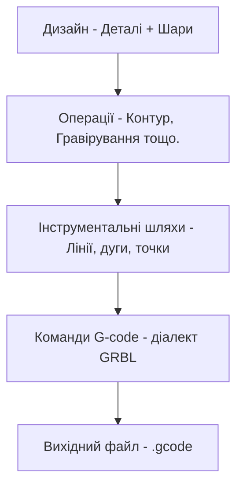

# Основи G-code

Розуміння G-code допомагає виправляти проблеми та налаштовувати вивід Rayforge.

## Високорівневий процес

Rayforge конвертує ваші дизайни у G-code через багатокроковий процес:



**Що робить Rayforge:**

1. **Аналізує ваш дизайн** - Витягує геометрію з деталей
2. **Застосовує операції** - Визначає шляхи різання/гравірування
3. **Оптимізує інструментальні шляхи** - Переупорядковує шляхи, мінімізує переміщення
4. **Генерує команди** - Конвертує шляхи в G-code
5. **Вставляє хуки** - Додає користувацькі макроси у вказані точки
6. **Записує файл** - Виводить повний G-code готовий для машини

## Простий приклад

Ось базова структура файлу G-code, що показує різання квадрата:

```gcode
G21 ;Встановити одиниці в мм
G90 ;Абсолютне позиціонування
G54
T0
G0 X95.049 Y104.951 Z0.000
M4 S500
G1 X104.951 Y104.951 Z0.000 F3000
G1 X104.951 Y95.049 Z0.000 F3000
G1 X95.049 Y95.049 Z0.000 F3000
G1 X95.049 Y104.951 Z0.000 F3000
M5
G0 X95.000 Y105.000 Z0.000
M4 S500
G1 X95.000 Y95.000 Z0.000 F3000
G1 X105.000 Y95.000 Z0.000 F3000
G1 X105.000 Y105.000 Z0.000 F3000
G1 X95.000 Y105.000 Z0.000 F3000
M5
M5 ;Переконатися що лазер вимкнено
G0 X0 Y0 ;Повернутися до початку
```

**Основні команди:**

| Команда | Опис |
| ------- | ----------- |
| `G21` | Режим міліметрів |
| `G90` | Абсолютне позиціонування |
| `G54` | Вибрати робочу систему координат 1 |
| `T0` | Вибрати інструмент 0 (лазерна головка) |
| `G0` | Швидке переміщення (лазер вимкнено) |
| `G1` | Переміщення різання (лазер увімкнено) |
| `M4` | Лазер увімкнено (режим динамічної потужності) |
| `M5` | Лазер вимкнено |
| `S500` | Встановити потужність лазера на 500 (50% для діапазону 0-1000) |
| `F3000` | Встановити швидкість подачі на 3000 мм/хв |

---

## Пов'язані сторінки

- [Діалекти G-code](../reference/gcode-dialects) - Відмінності прошивок
- [Експорт G-code](../files/exporting) - Налаштування та параметри експорту
- [Хуки та макроси](../machine/hooks-macros) - Вставка власного G-code
