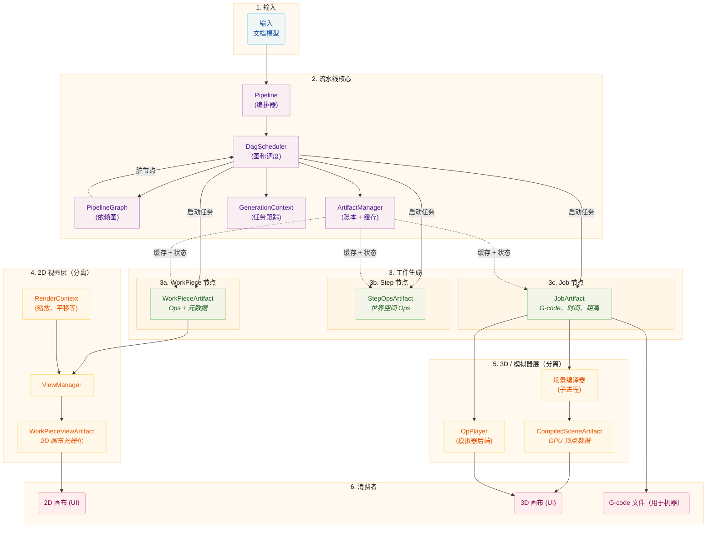

# 流水线架构

本文档描述流水线架构，它使用有向无环图（DAG）来编排工件生成。流水线将原始设计数据转换为用于可视化和制造的最终输出，具有依赖感知调度和高效的工件缓存。

# 核心概念

## 工件节点和依赖图

流水线使用 **有向无环图（DAG）** 来建模工件及其依赖关系。每个工件在图中表示为 `ArtifactNode`。

### ArtifactNode

每个节点包含：

- **ArtifactKey**：由 ID 和组类型（`workpiece`、`step`、`job` 或 `view`）组成的唯一标识符
- **Dependencies**：此节点依赖的节点列表（子节点）
- **Dependents**：依赖此节点的节点列表（父节点）

节点不直接存储状态。相反，它们将状态读写委托给 `ArtifactManager`，后者维护所有工件及其状态的账本。

### 节点状态

节点经历五种状态：

| 状态           | 描述                                       |
| -------------- | ------------------------------------------ |
| `DIRTY`        | 工件需要（重新）生成                       |
| `PROCESSING`   | 任务正在生成工件                           |
| `VALID`        | 工件已就绪且是最新的                       |
| `ERROR`        | 生成失败                                   |
| `CANCELLED`    | 生成已取消；如果仍然需要将重试             |

当一个节点被标记为脏时，其所有依赖者也被标记为脏，将失效沿图向上传播。

### PipelineGraph

`PipelineGraph` 从文档模型构建，包含：

- 每个 `(WorkPiece, Step)` 对的一个节点
- 每个 Step 的一个节点
- Job 的一个节点

建立依赖关系：

- Steps 依赖于其 `(WorkPiece, Step)` 对节点
- Job 依赖于所有 Steps

## DagScheduler

`DagScheduler` 是流水线的中央编排器。它拥有 `PipelineGraph` 并负责：

1. 从文档模型 **构建图**
2. **识别就绪节点**（DIRTY 且所有依赖项为 VALID）
3. 通过相应的流水线阶段 **触发任务启动**
4. 通过生成过程 **跟踪状态**
5. 当工件就绪时 **通知消费者**

调度器使用生成 ID 来跟踪哪些工件属于哪个文档版本，允许跨生成重用有效工件。

关键行为：

- 构建图时，调度器将节点状态与工件管理器同步，以识别可以重用的缓存工件
- 如果前一代的工件仍然有效，可以重用
- 即使在图重建之前也会跟踪失效，并在之后重新应用
- 调度器将实际任务创建委托给各阶段，但根据依赖就绪情况控制 **何时** 启动任务

## ArtifactManager

`ArtifactManager` 同时充当缓存和工件状态的唯一事实来源。它：

- 通过 **账本**（以 `ArtifactKey` + 生成 ID 为键）存储和检索工件句柄
- 在账本条目中跟踪状态（`DIRTY`、`VALID`、`ERROR` 等）
- 管理共享内存清理的引用计数
- 处理生命周期（创建、保留、释放、清理）
- 提供上下文管理器用于安全的工件接管、完成、失败和取消报告

## GenerationContext

每次协调周期创建一个 `GenerationContext`，跟踪该生成的所有活动任务。它确保共享内存资源在该生成的所有进行中任务完成之前保持有效，即使新的生成已经开始。当上下文被取代且其所有任务完成时，它会自动释放其资源。

## 共享内存生命周期

工件存储在共享内存（`multiprocessing.shared_memory`）中，用于工作进程和主进程之间高效的进程间通信。`ArtifactStore` 管理这些内存块的生命周期。

### 所有权模式

**本地所有权：** 创建进程拥有句柄并在完成后释放它。这是最简单的模式。

**进程间交接：** 工作进程创建工件，通过 IPC 将其发送到主进程，并转移所有权。工作进程"忘记"句柄（关闭其文件描述符而不取消链接内存），而主进程"收养"它并负责最终释放。

### 过期工件检测

`StaleGenerationError` 机制防止来自被取代生成的工件被接管。当新的生成开始时，管理器在接管期间检测过期工件并静默丢弃它们。

## 流水线阶段

流水线阶段（`WorkPiecePipelineStage`、`StepPipelineStage`、`JobPipelineStage`）负责任务执行的 **具体机制**：

- 它们通过 `TaskManager` 创建和注册子进程任务
- 它们处理任务事件（渐进式块、中间结果）
- 它们在任务完成时管理工件接管和缓存
- 它们发出信号通知流水线状态变化

**DagScheduler** 决定 **何时** 触发每个阶段，但各阶段处理实际的子进程生成、事件处理和结果接管。

## 失效策略

失效由文档模型的更改触发，根据更改内容采用不同策略：

| 更改类型         | 行为                                                                                           |
| ---------------- | ---------------------------------------------------------------------------------------------- |
| 几何/参数        | Workpiece-step 对失效，级联到 Steps 和 Job                                                     |
| 位置/旋转        | Steps 直接失效（级联到 Job）；Workpiece 跳过，除非位置敏感                                     |
| 大小更改         | 与几何相同：从 Workpiece-step 对向上完整级联                                                   |
| 机器配置         | 所有工件在所有生成中强制失效                                                                   |

位置敏感的步骤（例如，启用了裁切到工作区域的步骤）即使在纯位置更改时也会触发 Workpiece 失效。

# 详细分解

## 输入

过程从 **文档模型** 开始，它包含：

- **WorkPieces：** 放置在画布上的单个设计元素（SVG、图像）
- **Steps：** 带有设置的处理指令（Contour、Raster 等）
- **Layers：** Workpiece 的分组，每个都有自己的工作流

## 流水线核心

### Pipeline（编排器）

`Pipeline` 类是高层指挥者，它：

- 通过信号监听文档模型的更改
- **防抖** 更改（200ms 协调延迟，50ms 移除延迟）
- 与 DagScheduler 协调触发重新生成
- 管理整体处理状态和忙碌检测
- 支持 **暂停/恢复** 用于批量操作
- 支持 **手动模式**（`auto_pipeline=False`），即重新计算显式触发而非自动触发
- 连接组件之间的信号并转发给消费者

### DagScheduler

`DagScheduler`：

- 构建和维护 `PipelineGraph`
- 识别准备好处理的节点
- 通过各阶段的 `launch_task()` 方法触发任务启动
- 通过账本跟踪节点状态转换
- 当工件就绪时发出信号

### ArtifactManager

`ArtifactManager`：

- 维护 `LedgerEntry` 对象的 **账本**，每个条目跟踪句柄、生成 ID 和节点状态
- 在共享内存中缓存工件句柄
- 管理引用计数以进行清理
- 通过 ArtifactKey 和生成 ID 提供查找
- 清理过时的生成以保持账本整洁

### GenerationContext

每次协调创建一个新的 `GenerationContext`，它：

- 通过引用计数的键跟踪活动任务
- 拥有其生成的共享内存资源
- 当被取代且所有任务完成时自动关闭

## 工件生成

### WorkPieceArtifacts

为每个 `(WorkPiece, Step)` 组合生成。包含：

- Workpiece 本地坐标系中的刀具路径（`Ops`）
- 可缩放标志和源尺寸，用于分辨率无关的 Ops
- 坐标系和生成元数据

处理序列：

1. **生产者：** 从 Workpiece 数据创建原始刀具路径（`Ops`）
2. **转换器：** 按有序阶段应用的每工件修改（几何精炼 → 路径中断 → 后处理）

大型光栅 Workpiece 分块增量处理，在生成期间提供渐进式视觉反馈。

### StepOpsArtifacts

为每个 Step 生成，消耗所有相关的 WorkPieceArtifacts：

- 所有工件在世界空间坐标中的组合 Ops
- 应用的每步转换器（Optimize、Multi-Pass 等）

### JobArtifact

在需要 G-code 时按需生成，消耗所有 StepOpsArtifacts：

- 最终机器代码（G-code 或驱动特定格式）
- 用于模拟和回放的完整 Ops
- 高保真时间估计和总距离
- 用于 3D 预览的旋转映射 Ops

## 2D 视图层（分离）

`ViewManager` 与数据流水线 **解耦**。它根据 UI 状态处理 2D 画布的渲染：

### RenderContext

包含当前视图参数：

- 每毫米像素数（缩放级别）
- 视口偏移（平移）
- 显示选项（显示空行程等）

### WorkPieceViewArtifacts

ViewManager 创建 `WorkPieceViewArtifacts`，它：

- 将 WorkPieceArtifacts 光栅化到屏幕空间
- 应用当前 RenderContext
- 被缓存并在上下文或源更改时更新

### 生命周期

1. ViewManager 跟踪源 `WorkPieceArtifact` 句柄
2. 当渲染上下文更改时，ViewManager 触发重新渲染
3. 当源工件更改时，ViewManager 触发重新渲染
4. 重新渲染有节流（33ms 间隔）和并发限制
5. 渐进式块拼接提供增量视觉更新

ViewManager 按 `(workpiece_uid, step_uid)` 索引视图，以支持在多个步骤中可视化工件的中间状态。

## 3D / 模拟器层（分离）

3D 可视化和模拟系统与数据流水线 **解耦**，遵循与 ViewManager 类似的模式。它包括：

- 一个 **场景编译器**，在子进程中运行，将 `JobArtifact` 的 Ops 转换为 GPU 就绪的顶点数据
- 一个 **OpPlayer**，重放作业的 Ops 用于带播放控制的实时机器模拟

两者都消耗流水线作业阶段产生的 `JobArtifact`。

### CompiledSceneArtifact

场景编译器生成一个 `CompiledSceneArtifact`，包含：

- **顶点层：** 加工/空行程/零功率顶点缓冲区，带每命令偏移量用于渐进显示
- **纹理层：** 用于雕刻预览的光栅化扫描线功率图
- **叠加层：** 用于实时高亮的扫描线功率段
- 支持旋转（圆柱包裹）几何

### 编译流水线

1. Canvas3D 监听 `job_generation_finished` 信号
2. 当新作业就绪时，它在子进程中调度场景编译
3. 子进程从共享内存读取 `JobArtifact` 并将 Ops 编译为 GPU 顶点数据
4. 编译后的场景被接收到共享内存并上传到 GPU 渲染器

### OpPlayer（模拟器后端）

`OpPlayer` 逐命令遍历作业的 Ops，维护一个跟踪位置、激光状态和辅助轴的 `MachineState`。它驱动：

- 3D 画布回放（刀具路径的渐进显示）
- 机器头位置和激光束可视化
- 用于播放滑块的每命令步进

## 消费者

| 消费者   | 使用                        | 目的                             |
| -------- | --------------------------- | -------------------------------- |
| 2D 画布  | WorkPieceViewArtifacts      | 在屏幕空间中渲染工件             |
| 3D 画布  | CompiledSceneArtifact       | 在 3D 中渲染完整作业并支持回放   |
| 机器     | JobArtifact（机器代码）     | 制造输出                         |

# 关键架构决策

1. **基于 DAG 的调度：** 不是顺序阶段，工件在其依赖项可用时生成，实现并行处理。

2. **基于账本的状态：** 节点状态在 ArtifactManager 的账本条目中跟踪，而不是在图节点本身中，为状态和句柄存储提供单一事实来源。

3. **视图层分离：** 2D 画布（ViewManager）和 3D 画布（场景编译器）都与数据流水线解耦。各自运行自己的基于子进程的渲染，由流水线信号驱动，而不是 DAG 的一部分。

4. **生成 ID：** 工件用生成 ID 跟踪，允许跨文档版本高效重用和过期工件检测。

5. **集中编排：** DagScheduler 是任务调度的单一控制点；各阶段处理执行的具体机制。

6. **GenerationContext 隔离：** 每个生成都有自己的上下文，确保资源在进行中的任务完成之前保持存活。

7. **失效跟踪：** 在图重建之前标记为脏的键被保留并在重建后重新应用。

8. **防抖协调：** 更改通过可配置的延迟批量处理，以避免在快速编辑期间过多的流水线周期。
