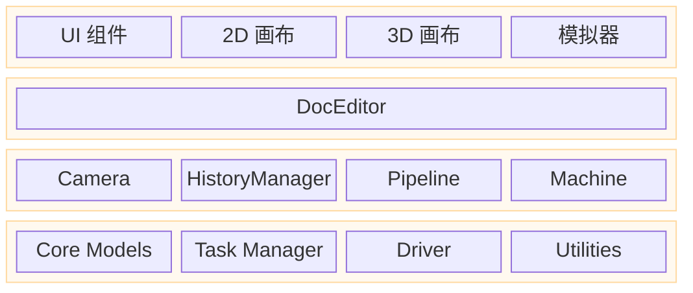

# Rayforge 架构

本文档提供 Rayforge 的高层架构概述，解释主要组件之间的关系。如需深入了解特定领域，请参阅链接的文档。

## 目录

- [分层应用架构](#分层应用架构)
- [代码架构](#代码架构)
- [文档模型架构](#文档模型架构)
- [流水线架构](#流水线架构)

---

## 分层应用架构

应用程序按逻辑层构建，分离用户界面、应用逻辑和核心服务。这促进了清晰的关注点分离并明确了控制流程。

- **UI 层（视图）**：包含所有面向用户的元素。`Workbench` 是主画布区域，承载 2D 和 3D 视图。
- **编辑器/控制器层**：`DocEditor` 充当中央控制器，响应 UI 事件并操作核心模型。
- **核心/服务层**：提供基础服务和状态。`Core Models` 表示文档，`Tasker` 管理后台作业，`Machine` 处理设备通信，`Camera` 管理视口。

---

## 代码架构

Rayforge 是一个具有模块化、流水线驱动架构的 GTK4/Libadwaita 应用程序。

- **`rayforge/core/`**：文档模型和几何处理。
- **`rayforge/pipeline/`**：从文档模型生成机器操作的核心处理流水线。
- **`rayforge/machine/`**：硬件接口层，包括设备驱动程序、传输协议和机器模型。
- **`rayforge/doceditor/`**：主文档编辑器控制器及其 UI。
- **`rayforge/workbench/`**：2D/3D 画布和可视化系统。
- **`rayforge/image/`**：各种文件格式的导入器（SVG、DXF 等）。
- **`rayforge/shared/`**：通用工具，包括用于后台作业管理的 `tasker`。

---

## 文档模型架构

文档模型是基于 **组合模式** 的对象层次树。此结构表示用户的整个项目，从根 `Doc` 对象到各个 `WorkPiece`。它被设计为响应式和可序列化的。

**[详见文档模型架构](./docmodel.md)**

---

## 流水线架构

流水线将文档模型转换为机器可执行的 G-code。它在后台异步运行，使用共享内存 `Artifact` 系统在进程之间进行高性能数据传输。流水线由多个阶段组成：**修改器 → 生产者 → 转换器 → 编码器**。

**[详见流水线架构](./pipeline.md)**
