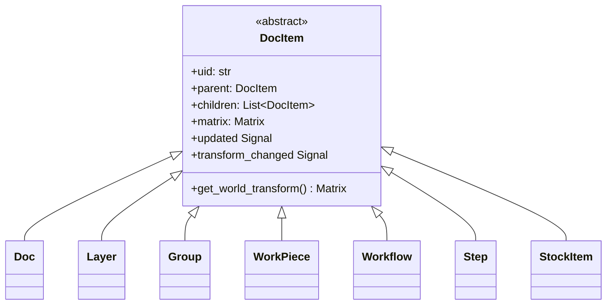
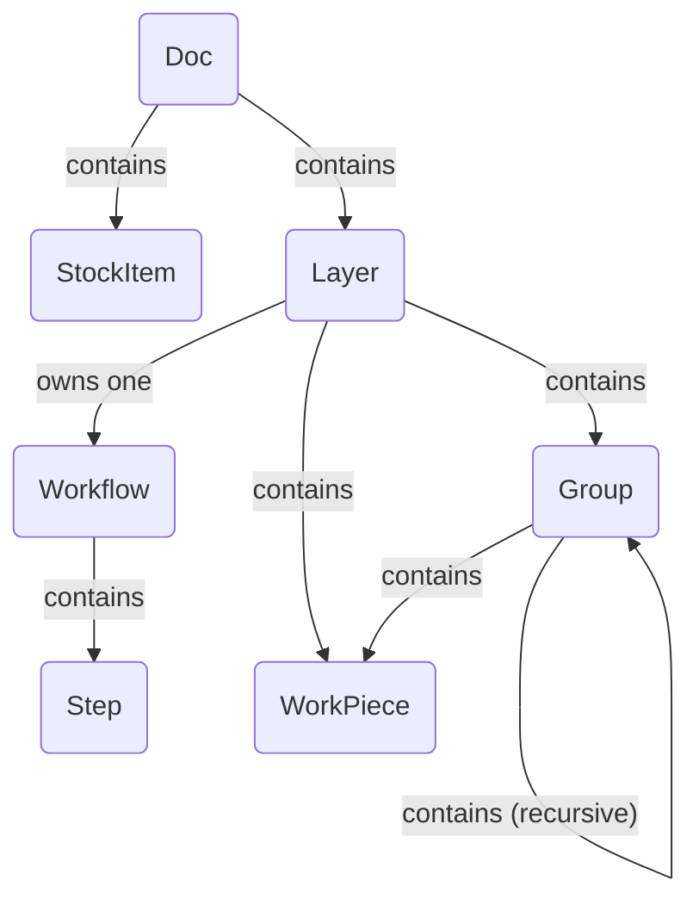

# 文档模型架构

文档模型是应用程序的骨干，将整个用户项目表示为对象的层次树。它被设计为响应式、可序列化和易于遍历的。

## 概述

架构基于 **组合设计模式**。一个抽象基类 `DocItem` 定义了文档树中可以存在的所有对象（例如图层、工件、组）的通用接口。这允许统一处理复杂的嵌套结构。

模型的关键原则包括：

- **树结构：** `Doc` 对象作为树的根。每个项（根除外）都有一个 `parent` 并可以有多个 `children`。
- **响应式：** 模型使用信号/槽系统（`blinker`）。当项被更改时，它发出信号。父项监听其子项的信号并将它们"冒泡"上树。这允许高级组件如 `Pipeline` 通过连接到根 `Doc` 对象上的单个信号来监听文档中的任何更改。系统分别跟踪内容更改和变换更改以进行高效更新。
- **变换层次结构：** 每个 `DocItem` 都有一个局部变换 `Matrix`。项在"世界"（主画布）中的最终位置、缩放和旋转是其自身局部矩阵和所有祖先的世界矩阵的乘积。
- **数据解耦：** `WorkPiece` 的视觉或原始数据不直接存储在其中。相反，`WorkPiece` 持有一个 UID，引用 `Doc` 上中央注册表中的 `ImportSource` 对象。这将文档结构与数据管理解耦，使模型更轻量和灵活。

---

## 类继承

此图显示类层次结构。作为文档空间树一部分的每个对象都继承自抽象基类 `DocItem`，获得核心功能如父级、变换和信号冒泡。

- **`DocItem`**：提供组合模式实现的抽象基础。
- 所有其他类都是 `DocItem` 的具体实现，每个在文档结构中都有专门的角色。

---

## 对象组合

此图说明了类的实例如何组装成完整的文档。它显示了对象之间的父子关系和引用。

- `Doc` 是顶层对象。它 **包含** 一个或多个 `Layer` 和 `StockItem`。它还 **管理** 项目中所有 `ImportSource` 的注册表。
- 每个 `Layer` **包含** 用户的内容：`WorkPiece` 和 `Group`。关键是，`Layer` 还 **拥有一个** `Workflow`。
- `Workflow` **包含** 有序的 `Step` 列表，定义该图层的制造过程。
- `Group` 是一个容器，可以容纳 `WorkPiece` 和其他 `Group`，允许嵌套变换。
- `WorkPiece` 是基本设计元素。它不直接存储其原始数据。相反，它通过 UID **引用** `ImportSource`。它还 **拥有** 自己的 `Geometry`（矢量数据）并可以有 `Tab` 列表。

---

## DocItem 描述

- **`DocItem`（抽象）**

  - **角色：** 所有树节点的抽象基类。
  - **关键属性：** `uid`、`parent`、`children`、`matrix`、`updated` 信号、`transform_changed` 信号。提供核心组合模式逻辑。

- **`Doc`**

  - **角色：** 文档树的根。
  - **关键属性：** `children`（Layers、StockItems）、`import_sources`（将 UID 映射到 `ImportSource` 对象的字典）、`active_layer`。

- **`Layer`**

  - **角色：** 内容的主要组织单位。图层将一组工件与单个制造工作流程相关联。
  - **关键属性：** `children`（WorkPieces、Groups、一个 Workflow）、`visible`、`stock_item_uid`。

- **`Group`**

  - **角色：** 其他 `DocItem`（`WorkPiece`、`Group`）的容器。允许作为单个单元变换一组项。

- **`WorkPiece`**

  - **角色：** 表示画布上的单个有形设计元素（例如导入的 SVG）。
  - **关键属性：** `vectors`（`Geometry` 对象）、`import_source_uid`、`tabs`、`tabs_enabled`。其 `vectors` 被归一化为 1x1 盒子，所有缩放和定位由其变换 `matrix` 处理。

- **`Workflow`**

  - **角色：** 有序的处理指令序列。由 `Layer` 拥有。
  - **关键属性：** `children`（有序的 `Step` 列表）。

- **`Step`**

  - **角色：** `Workflow` 中的单个处理指令（例如"轮廓切割"或"光栅雕刻"）。它是一个配置对象，保存定义要使用的生产者、修改器和转换器的字典。

- **`StockItem`**
  - **角色：** 表示文档中的一块物理材料，由其自己的矢量 `geometry` 定义。`Layer` 可以分配给特定的库存项。
