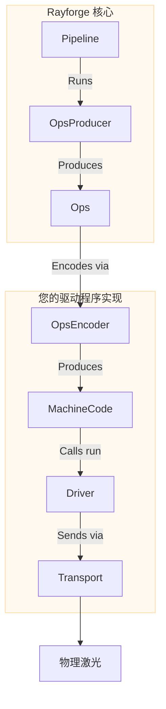

# 驱动程序开发指南

本指南提供了如何在 Rayforge 中创建驱动程序以添加对您的激光切割机或雕刻机支持的高层概述。通过创建驱动程序，您可以将机器的独特通信协议和命令语言集成到 Rayforge 生态系统中。

## 驱动程序概述

驱动程序是 Rayforge 核心逻辑与您的物理硬件之间的桥梁。它负责三个主要任务：

1.  **管理连接：** 处理低级通信协议（串口、WebSocket、HTTP 等）。
2.  **执行作业：** 将预编码的机器代码（例如 G-code）发送到设备并跟踪执行进度。
3.  **报告状态：** 发出信号以用激光的实时位置、状态（`IDLE`、`RUN`）和日志消息更新 UI。

为了简化这一点，Rayforge 提供了基于可组合部分的架构：



- **`OpsEncoder`：** 将 `Ops` 翻译为特定的命令语言（例如 G-code）。被流水线（用于作业编码）和驱动程序（用于 move_to、home 等单个命令）使用。
- **`Pipeline`：** 编排编码并生成最终机器代码。
- **`Transport`：** 管理连接和数据传输。
- **`Driver`：** 执行机器代码、处理设备状态并与 UI 通信。

所有驱动程序操作都是 **异步的**，以确保用户界面保持响应。

## `Ops` 语言

Rayforge 将激光作业描述为存储在 `Ops` 对象中的高级操作序列。这是 Rayforge 内用于描述机器运动的通用语言，独立于任何特定硬件。

| `Ops` 方法          | 签名                            | 描述                         |
| :------------------ | :------------------------------ | :--------------------------- |
| `move_to`           | `(x, y, z=0.0)`                 | 快速移动（不切割）           |
| `line_to`           | `(x, y, z=0.0)`                 | 切割/雕刻移动                |
| `arc_to`            | `(x, y, i, j, cw=True, z=0.0)`  | 切割/雕刻弧形移动            |
| `set_power`         | `(power)`                       | 设置激光功率（0-100%）       |
| `set_cut_speed`     | `(speed)`                       | 设置切割移动速度（mm/min）   |
| `set_travel_speed`  | `(speed)`                       | 设置快速移动速度（mm/min）   |
| `enable_air_assist` | `()`                            | 开启气助                     |
| `disable_air_assist`| `()`                            | 关闭气助                     |

您的驱动程序接收预编码的机器代码（例如 G-code 字符串）和一个跟踪哪些机器代码命令对应哪些操作的操作映射。流水线在调用驱动程序的 `run()` 方法之前处理将 `Ops` 编码为机器代码。

```python
# Rayforge 如何构建 Ops 对象的示例
ops = Ops()
ops.set_travel_speed(3000)
ops.set_cut_speed(800)
ops.set_power(80)

ops.move_to(10, 10)       # 快速移动到起点
ops.enable_air_assist()
ops.line_to(50, 10)       # 用气助切割一条线
ops.disable_air_assist()
ops.line_to(50, 50)       # 不用气助切割一条线
```

## 驱动程序实现

所有驱动程序必须继承自 `rayforge.machine.drivers.Driver`。

```python
from rayforge.machine.driver.driver import Driver

class YourDriver(Driver):
    label = "Your Device"  # UI 中显示的名称
    subtitle = "Description for users"
    supports_settings = False # 如果驱动程序可以读/写固件设置则设为 True
```

### 必需属性

- `label`：UI 中显示的人类可读名称。
- `subtitle`：名称下方显示的简要描述。
- `supports_settings`：布尔值，指示驱动程序是否可以读/写设备设置（如 GRBL 的 `$$`）。

### 必需方法

您的驱动程序类 **必须** 实现以下方法。请注意，大多数是 **异步的**，必须用 `async def` 定义。

#### 配置和生命周期

- `get_setup_vars() -> VarSet`：**(类方法)** 返回定义连接所需参数（例如 IP 地址、串口）的 `VarSet` 对象。Rayforge 使用此对象自动生成 UI 中的设置表单。
- `precheck(**kwargs)`：**(类方法)** 配置的非阻塞静态检查，可在驱动程序实例化之前运行。失败时应引发 `DriverPrecheckError`。
- `setup(**kwargs)`：使用设置表单中的值调用一次。用于初始化您的传输和内部状态。
- `async def connect()`：建立并维护与设备的持久连接。此方法应包含自动重连逻辑。
- `async def cleanup()`：断开连接时调用。应关闭所有连接并释放资源。

#### 设备控制

- `async def run(machine_code: Any, op_map: MachineCodeOpMap, doc: Doc,
  on_command_done: Optional[Callable[[int], Union[None, Awaitable[None]]]]
  = None)`：执行作业的核心方法。接收预编码的机器代码（例如 G-code 字符串）和操作索引与机器代码之间的映射。当每个命令完成时，使用 op_index 调用 `on_command_done` 回调。
- `async def home(axes: Optional[Axis] = None)`：归位机器。可以归位特定轴或所有轴。
- `async def move_to(pos_x: float, pos_y: float)`：手动将激光头移动到特定 XY 坐标。
- `async def set_hold(hold: bool = True)`：暂停或恢复当前作业。
- `async def cancel()`：停止当前作业。
- `async def jog(axis: Axis, distance: float, speed: int)`：沿特定轴点动机器。
- `async def select_tool(tool_number: int)`：通过编号选择新的工具/激光头。
- `async def clear_alarm()`：清除任何活动报警状态。

#### 固件设置（如果 `supports_settings` 为 `True`）

- `get_setting_vars() -> List[VarSet]`：返回定义设备设置页面结构的 `VarSet` 对象。
- `async def read_settings()`：从设备读取所有设置并使用结果调用 `_on_settings_read()`。
- `async def write_setting(key: str, value: Any)`：将单个设置写入设备。

### 发出信号

要与 UI 通信，您的驱动程序必须发出信号。为确保正确的日志记录和线程安全，**您不能直接发出信号。** 相反，从基 `Driver` 类调用受保护的帮助方法。

- `self._log(message)`：向控制台发送日志消息。
- `self._on_state_changed()`：每当您更新 `self.state` 时调用此方法以通知 UI 状态或位置更改。
- `self._on_connection_status_changed(status, message)`：通知 UI 连接状态（`CONNECTING`、`CONNECTED`、`ERROR` 等）。
- `self._on_command_status_changed(status, message)`：报告已发送命令的状态。
- `self._on_settings_read(settings)`：将您读取的设备设置发送回 UI。

## 有问题？

学习的最佳方式是查看 `rayforge/machine/driver/` 中的现有驱动程序，例如：

- `grbl.py` - 基于 GRBL 的机器
- `grbl_serial.py` - 基于串口的 GRBL 通信
- `smoothie.py` - 基于 Smoothieboard 的机器
- `dummy.py` - 用于开发的测试驱动程序

如果您遇到困难，请不要犹豫在 GitHub 上开 issue！我们很乐意提供帮助。
