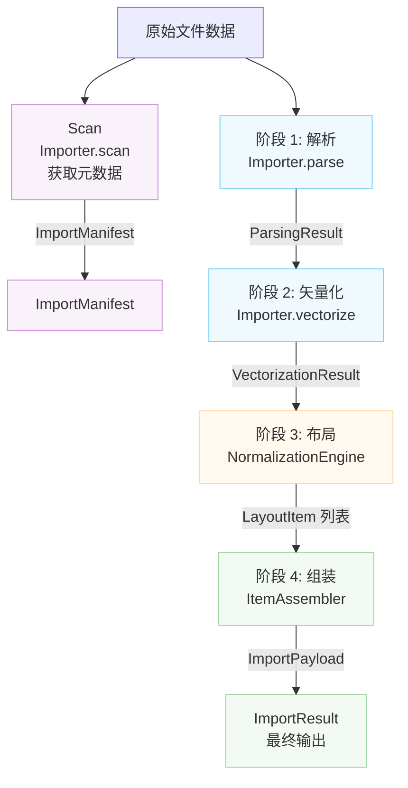

# 导入器架构

本文档描述 Rayforge 文件导入系统的架构，它处理将各种文件格式（SVG、DXF、PNG、PDF 等）转换为 Rayforge 文档模型。

## 目录

- [概述](#概述)
- [导入流水线](#导入流水线)
- [扫描方法](#扫描方法)
- [坐标系](#坐标系)
- [关键类](#关键类)
- [创建新导入器](#创建新导入器)

---

## 概述

导入系统围绕四阶段流水线构建，将原始文件数据转换为完全定位的文档对象。每个阶段有特定职责并产生明确定义的数据结构。



---

## 导入流水线

### 阶段 1：解析

**方法：** `Importer.parse()`

从文件中提取几何事实，包括边界、坐标系详情和图层信息。

**输出：** `ParsingResult`

- `document_bounds`：本机坐标系中的总画布大小
- `native_unit_to_mm`：到毫米的转换因子
- `is_y_down`：Y 轴方向标志
- `layers`：`LayerGeometry` 列表
- `world_frame_of_reference`：世界坐标（mm，Y-Up）
- `background_world_transform`：背景定位矩阵
- `untrimmed_document_bounds`：Y 反转的参考

**坐标系：**

- `document_bounds`：本机坐标（文件特定）
- `world_frame_of_reference`：世界坐标（mm，Y-Up）

---

### 阶段 2：矢量化

**方法：** `Importer.vectorize()`

根据 `VectorizationSpec` 将解析数据转换为矢量 `Geometry` 对象。

**输出：** `VectorizationResult`

- `geometries_by_layer`：每层矢量几何（本机坐标）
- `source_parse_result`：原始 ParsingResult 的引用
- `fills_by_layer`：可选填充几何（Sketch 导入器）

**坐标系：** 本机坐标（文件特定）

---

### 阶段 3：布局

**类：** `NormalizationEngine`

根据用户意图计算变换矩阵，将本机坐标映射到世界坐标。

**输出：** `List[LayoutItem]`

每个 `LayoutItem` 包含：

- `world_matrix`：归一化（0-1, Y-Up）→ 世界（mm，Y-Up）
- `normalization_matrix`：本机 → 归一化（0-1, Y-Up）
- `crop_window`：本机坐标中原始文件的子集
- `layer_id`、`layer_name`：图层标识

**坐标系：**

- 输入：本机坐标
- 输出：世界坐标（mm，Y-Up）通过中间归一化空间

---

### 阶段 4：组装

**类：** `ItemAssembler`

根据布局计划实例化 Rayforge 领域对象（`WorkPiece`、`Layer`）。

**输出：** `ImportPayload`

- `source`：`SourceAsset`
- `items`：准备插入的 `DocItem` 列表
- `sketches`：可选的 `Sketch` 对象列表

**坐标系：** 所有 DocItems 在世界坐标（mm，Y-Up）中

---

## 扫描方法

**方法：** `Importer.scan()`

一种轻量级扫描，无需完整处理即可提取元数据。用于为导入器构建 UI，包括图层选择列表。这 **不是** 由 `get_doc_items()` 执行的主导入流水线的一部分。

**输出：** `ImportManifest`

- `layers`：`LayerInfo` 对象列表
- `natural_size_mm`：物理尺寸，单位毫米（Y-Up）
- `title`：可选文档标题
- `warnings`、`errors`：发现的非关键问题

**坐标系：** `natural_size_mm` 的世界坐标（mm，Y-Up）

---

## 坐标系

导入流水线通过仔细的变换处理多个坐标系：

### 本机坐标（输入）

- 文件特定坐标系（SVG 用户单位、DXF 单位、像素）
- Y 轴方向因格式而异
- 边界在文档坐标空间内是绝对的
- 通过 `native_unit_to_mm` 因子将单位转换为 mm

### 归一化坐标（中间）

- 从 (0,0) 到 (1,1) 的单位正方形
- Y 轴指向上（Y-Up 约定）
- 用作本机和世界之间的中间表示

### 世界坐标（输出）

- 毫米为单位的物理世界坐标（mm）
- Y 轴指向上（Y-Up 约定）
- 原点 (0,0) 在工件左下角
- 所有位置在世界坐标系中是绝对的

### Y 轴方向

- **Y-Down 格式**（SVG、图像）：原点在左上角，Y 向下增加
- **Y-Up 格式**（DXF）：原点在左下角，Y 向上增加
- 导入器必须在 `ParsingResult` 中正确设置 `is_y_down` 标志
- `NormalizationEngine` 为 Y-Down 源处理 Y 反转

---

## 关键类

### Importer（基类）

定义所有导入器接口的抽象基类。子类必须实现流水线方法并通过 `features` 属性声明其功能。

**功能：**

- `BITMAP_TRACING`：可以将光栅图像描摹为矢量
- `DIRECT_VECTOR`：可以直接提取矢量几何
- `LAYER_SELECTION`：支持基于图层的导入
- `PROCEDURAL_GENERATION`：以编程方式生成内容

### 数据结构

| 类                    | 阶段     | 目的             |
| --------------------- | -------- | ---------------- |
| `LayerInfo`           | Scan     | 轻量级图层元数据 |
| `ImportManifest`      | Scan     | 扫描阶段结果     |
| `LayerGeometry`       | Parse    | 几何图层信息     |
| `ParsingResult`       | Parse    | 几何事实         |
| `VectorizationResult` | Vectorize| 矢量几何         |
| `LayoutItem`          | Layout   | 变换配置         |
| `ImportPayload`       | Assemble | 最终输出         |
| `ImportResult`        | Final    | 完整结果包装器   |

### 支持组件

- `NormalizationEngine`：阶段 3 布局计算
- `ItemAssembler`：阶段 4 对象创建

---

## 创建新导入器

要添加对新文件格式的支持：

1. **创建新的导入器类**，继承自 `Importer`
2. **声明支持的功能**，通过 `features` 类属性
3. **实现必需方法**：
   - `scan()`：快速提取元数据（用于 UI 预览）
   - `parse()`：提取几何事实
   - `vectorize()`：转换为矢量几何
   - `create_source_asset()`：创建源资产
4. **注册导入器**在 `rayforge/image/__init__.py` 中
5. **添加 MIME 类型和扩展名映射**

**示例：**

```python
from rayforge.image.base_importer import Importer, ImporterFeature
from rayforge.image.structures import (
    ImportManifest,
    ParsingResult,
    VectorizationResult,
)
from rayforge.core.source_asset import SourceAsset

class MyFormatImporter(Importer):
    label = "My Format"
    mime_types = ("application/x-myformat",)
    extensions = (".myf",)
    features = {ImporterFeature.DIRECT_VECTOR}

    def scan(self) -> ImportManifest:
        # 无需完整处理即可提取元数据
        return ImportManifest(
            layers=[],
            natural_size_mm=(100.0, 100.0),
        )

    def parse(self) -> Optional[ParsingResult]:
        # 提取几何事实
        return ParsingResult(
            document_bounds=(0, 0, 100, 100),
            native_unit_to_mm=1.0,
            is_y_down=False,
            layers=[],
            world_frame_of_reference=(0, 0, 100, 100),
            background_world_transform=Matrix.identity(),
        )

    def vectorize(
        self, parse_result: ParsingResult, spec: VectorizationSpec
    ) -> VectorizationResult:
        # 转换为矢量几何
        return VectorizationResult(
            geometries_by_layer={None: Geometry()},
            source_parse_result=parse_result,
        )

    def create_source_asset(
        self, parse_result: ParsingResult
    ) -> SourceAsset:
        # 创建源资产
        return SourceAsset(
            original_data=self.raw_data,
            metadata={},
        )
```
