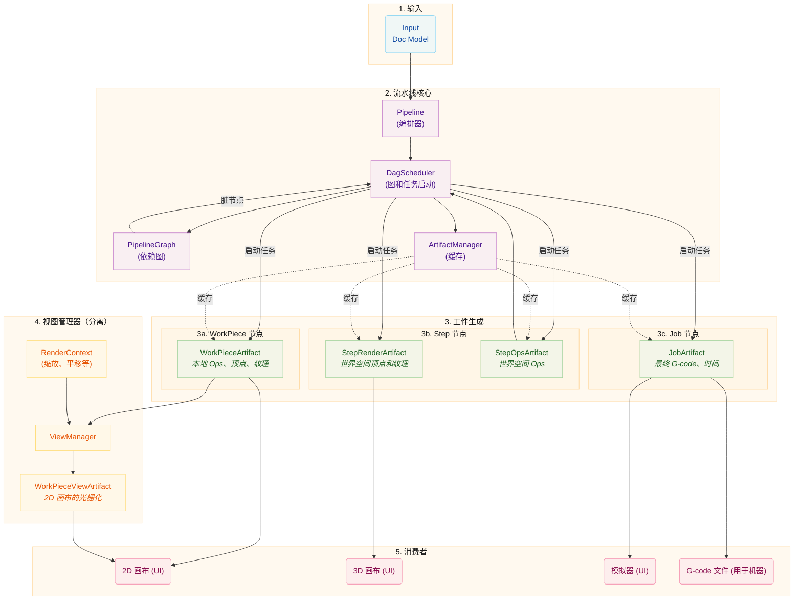

# 流水线架构

本文档描述流水线架构，它使用有向无环图（DAG）来编排工件生成。流水线将原始设计数据转换为用于可视化和制造的最终输出，具有依赖感知调度和高效的工件缓存。

# 核心概念

## 工件节点和依赖图

流水线使用 **有向无环图（DAG）** 来建模工件及其依赖关系。每个工件在图中表示为 `ArtifactNode`。

### ArtifactNode

每个节点包含：

- **ArtifactKey**：由 ID 和组类型（`workpiece`、`step`、`job` 或 `view`）组成的唯一标识符
- **State**：节点当前的生命周期状态
- **Dependencies**：此节点依赖的节点列表（子节点）
- **Dependents**：依赖此节点的节点列表（父节点）

### 节点状态

节点经历四种状态：

| 状态           | 描述                     |
| -------------- | ------------------------ |
| `DIRTY`        | 工件需要重新生成         |
| `PROCESSING`   | 任务正在生成工件         |
| `VALID`        | 工件已就绪且是最新的     |
| `ERROR`        | 生成失败                 |

当一个节点被标记为脏时，其所有依赖者也被标记为脏，将失效沿图向上传播。

### PipelineGraph

`PipelineGraph` 从 Doc 模型构建，包含：

- 每个 `(WorkPiece, Step)` 对的一个节点
- 每个 Step 的一个节点
- Job 的一个节点

建立依赖关系：

- Steps 依赖于其 `(WorkPiece, Step)` 对节点
- Job 依赖于所有 Steps

## DagScheduler

`DagScheduler` 是流水线的中央编排器。它拥有 `PipelineGraph` 并负责：

1. 从 Doc 模型 **构建图**
2. **识别就绪节点**（DIRTY 且所有依赖项为 VALID）
3. **启动任务**生成工件
4. 通过生成过程 **跟踪状态**
5. 当工件就绪时 **通知消费者**

调度器使用生成 ID 来跟踪哪些工件属于哪个文档版本，允许跨生成重用有效工件。

关键行为：

- 构建图时，调度器将节点状态与工件管理器同步，以识别可以重用的缓存工件
- 如果前一代的工件仍然有效，可以重用
- 调度器跟踪哪些生成 ID 有正在运行的任务，以在生成转换期间保留工件
- 即使在图重建之前也会跟踪失效，并在之后重新应用

## ArtifactManager

`ArtifactManager` 是工件句柄的纯缓存管理器。它：

- 存储和检索工件句柄
- 管理引用计数以进行清理
- 处理生命周期（创建、保留、释放）
- 不跟踪状态（状态由 DAG 调度器管理）

## 共享内存生命周期

工件存储在共享内存（`multiprocessing.shared_memory`）中，用于工作进程和主进程之间高效的进程间通信。`ArtifactStore` 管理这些内存块的生命周期。

### 所有权模式

**本地所有权：** 创建进程拥有句柄并在完成后释放它。这是最简单的模式。

**进程间交接：** 工作进程创建工件，通过 IPC 将其发送到主进程，并转移所有权。工作进程"忘记"句柄（关闭其文件描述符而不取消链接内存），而主进程"收养"它并负责最终释放。

### 引用计数

`ArtifactStore` 为每个共享内存块维护引用计数。多个调用者可以 `retain()` 句柄，只有当计数达到零时才取消链接内存块。这被 `ViewManager` 用于渐进式渲染，其中多个回调可能访问同一工件。

## 流水线阶段

流水线阶段（`WorkPiecePipelineStage`、`StepPipelineStage`、`JobPipelineStage`）现在作为接口而不是任务启动器：

- 它们处理来自 UI 的失效请求
- 它们将任务启动委托给 DagScheduler
- 它们提供对缓存工件的访问
- 它们将信号从调度器转发到 UI

## InvalidationScope

`InvalidationScope` 枚举定义下游工件的失效范围：

| 范围                 | 描述                                                                                                     |
| -------------------- | -------------------------------------------------------------------------------------------------------- |
| `FULL_REPRODUCTION`  | 使工件失效，级联到步骤再到作业。用于需要工件重新生成的更改（几何、参数、大小更改）。                   |
| `STEP_ONLY`          | 直接使步骤失效，级联到作业。用于仅位置/旋转变换更改，其中工件几何保持不变。                             |

# 详细分解

## 输入

过程从 **Doc 模型**开始，它包含：

- **WorkPieces：** 放置在画布上的单个设计元素（SVG、图像）
- **Steps：** 带有设置的处理指令（Contour、Raster）

## 流水线核心

### Pipeline（编排器）

`Pipeline` 类是高层指挥者，它：

- 监听 Doc 模型的更改
- 与 DagScheduler 协调触发重新生成
- 管理整体处理状态
- 连接组件之间的信号

### DagScheduler

`DagScheduler`：

- 构建和维护 `PipelineGraph`
- 识别准备好处理的节点
- 通过 TaskManager 启动任务
- 跟踪节点状态转换
- 当工件就绪时发出信号

### ArtifactManager

`ArtifactManager`：

- 在共享内存中缓存工件句柄
- 管理引用计数以进行清理
- 通过 ArtifactKey 和生成 ID 提供查找

## 工件生成

### WorkPieceArtifacts

为每个 `(WorkPiece, Step)` 组合生成，包含：

- 本地坐标系中的刀具路径（`Ops`）
- 线条的顶点数据
- 光栅填充的纹理数据

处理序列：

1. **修改器：**（可选）图像处理（灰度等）
2. **生产者：** 创建原始刀具路径（`Ops`）
3. **转换器：** 每工件修改（Tabs、Smooth）
4. **顶点编码器：** 创建 GPU 友好的数据

### StepArtifacts

为每个 Step 生成，消耗所有相关的 WorkPieceArtifacts：

**StepRenderArtifact：**

- 所有工件的组合顶点和纹理数据
- 转换为世界空间坐标
- 针对 3D 画布渲染优化

**StepOpsArtifact：**

- 所有工件的组合 Ops
- 转换为世界空间坐标
- 包括每步转换器（Optimize、Multi-Pass）

### JobArtifact

在需要 G-code 时按需生成，消耗所有 StepOpsArtifacts：

- 整个作业的最终 G-code
- 模拟的完整顶点数据
- 高保真时间估计

## ViewManager（分离）

`ViewManager` 与数据流水线 **解耦**。它根据 UI 状态处理 2D 画布的渲染：

### RenderContext

包含当前视图参数：

- 每毫米像素数（缩放级别）
- 视口偏移（平移）
- 显示选项（显示空行程等）

### WorkPieceViewArtifacts

ViewManager 创建 `WorkPieceViewArtifacts`，它：

- 将 WorkPieceArtifacts 光栅化到屏幕空间
- 应用当前 RenderContext
- 被缓存并在上下文或源更改时更新

### 生命周期

1. ViewManager 跟踪源 `WorkPieceArtifact` 句柄
2. 当渲染上下文更改时，ViewManager 触发重新渲染
3. 当源工件更改时，ViewManager 触发重新渲染
4. 节流防止在连续更改期间过度更新

ViewManager 按 `(workpiece_uid, step_uid)` 索引视图，以支持在多个步骤中可视化工件的中间状态。

## 消费者

| 消费者   | 使用                    | 目的                     |
| -------- | ----------------------- | ------------------------ |
| 2D 画布  | WorkPieceViewArtifacts  | 在屏幕空间中渲染工件     |
| 3D 画布  | StepRenderArtifacts     | 在世界空间中渲染完整步骤 |
| 模拟器   | JobArtifact             | 机器路径的精确模拟       |
| 机器     | JobArtifact G-code      | 制造输出                 |

# 与之前架构的主要区别

1. **基于 DAG 的调度：** 不是顺序阶段，工件在其依赖项可用时生成。

2. **状态管理：** 节点状态在 DAG 图中跟踪，而不是在单个组件中。

3. **ViewManager 分离：** 2D 画布的渲染现在由单独的 ViewManager 处理，而不是作为数据流水线的一部分。

4. **生成 ID：** 工件用生成 ID 跟踪，允许跨文档版本高效重用。

5. **集中编排：** DagScheduler 是任务启动和状态跟踪的单一控制点。

6. **纯缓存管理器：** ArtifactManager 现在是简单的缓存，将所有状态管理委托给 DAG 调度器。

7. **失效跟踪：** 在图重建之前标记为脏的键被保留并在重建后重新应用。

8. **待处理工作检测：** 只有 `PROCESSING` 节点算作待处理工作；`DIRTY` 节点可能有未满足的依赖项（例如无视图上下文）。
