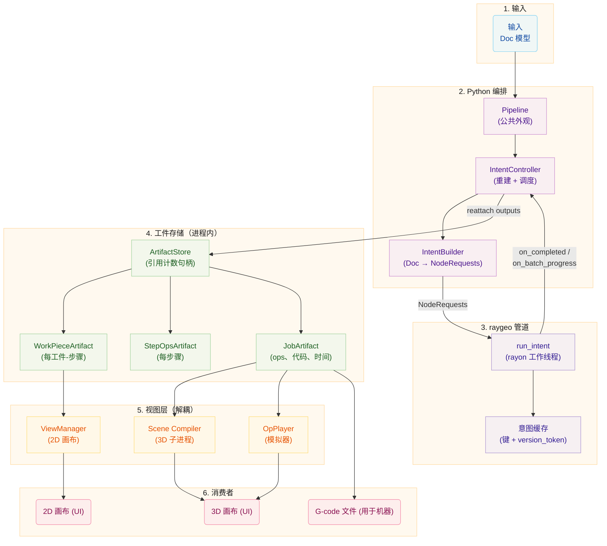

# 管道架构

本文档描述了将 `Doc` 模型转换为机器可执行 G-code 的管道。自 1.9.0 重写以来，该管道基于 **raygeo 意图** 构建：这是一种声明式描述，说明 Rust 端应执行的工作，配合一个轻量级的 Python 编排层和一个进程内引用计数的工件存储。

之前的多进程 DAG（`DagScheduler`、`PipelineGraph`、`ArtifactManager`、`GenerationContext`、`WorkPiecePipelineStage`）已被移除。本文档仅描述当前的活跃架构。

```mermaid
graph TD
    subgraph Input["1. 输入"]
        InputNode("输入<br/>Doc 模型")
    end

    subgraph PythonOrchestrator["2. Python 编排"]
        Pipeline["Pipeline<br/>(公共外观)"]
        IC["IntentController<br/>(重建 + 调度)"]
        IB["IntentBuilder<br/>(Doc &rarr; NodeRequests)"]
    end

    subgraph Raygeo["3. raygeo 管道"]
        RI["run_intent<br/>(rayon 工作线程)"]
        Cache["意图缓存<br/>(键 + version_token)"]
    end

    subgraph Artifacts["4. 工件存储（进程内）"]
        Store["ArtifactStore<br/>(引用计数句柄)"]
        WP["WorkPieceArtifact<br/>(每工件-步骤)"]
        SO["StepOpsArtifact<br/>(每步骤)"]
        JA["JobArtifact<br/>(ops、代码、时间)"]
    end

    subgraph View["5. 视图层（解耦）"]
        VM["ViewManager<br/>(2D 画布)"]
        SC["Scene Compiler<br/>(3D 子进程)"]
        OP["OpPlayer<br/>(模拟器)"]
    end

    subgraph Consumers["6. 消费者"]
        Vis2D("2D 画布 (UI)")
        Vis3D("3D 画布 (UI)")
        File("G-code 文件 (用于机器)")
    end

    InputNode --> Pipeline
    Pipeline --> IC
    IC --> IB
    IB -->|"NodeRequests"| RI
    RI -->|"on_completed /<br/>on_batch_progress"| IC
    RI --> Cache
    IC -->|"reattach outputs"| Store
    Store --> WP
    Store --> SO
    Store --> JA

    WP --> VM
    JA --> SC
    JA --> OP
    JA --> File

    VM --> Vis2D
    SC --> Vis3D
    OP --> Vis3D

    classDef clusterBox fill:#fff3e080,stroke:#ffb74d80,stroke-width:1px,color:#1a1a1a
    classDef inputNode fill:#e1f5fe80,stroke:#03a9f480,color:#0d47a1
    classDef pyNode fill:#f3e5f580,stroke:#9c27b080,color:#4a148c
    classDef raygeoNode fill:#ede7f680,stroke:#5e35b180,color:#311b92
    classDef artifactNode fill:#e8f5e980,stroke:#4caf5080,color:#1b5e20
    classDef viewNode fill:#fff8e180,stroke:#ffc10780,color:#e65100
    classDef consumerNode fill:#fce4ec80,stroke:#e91e6380,color:#880e4f
    class Input,PythonOrchestrator,Raygeo,Artifacts,View,Consumers clusterBox
    class InputNode inputNode
    class Pipeline,IC,IB pyNode
    class RI,Cache raygeoNode
    class Store,WP,SO,JA artifactNode
    class VM,SC,OP viewNode
    class Vis2D,Vis3D,File consumerNode
```

# 核心概念

## Pipeline（公共外观）

`rayforge/pipeline/pipeline.py:40` — 应用程序其他部分与之通信的类。`DocEditor`、`ViewManager`、UI 小部件和测试代码应仅依赖于 `Pipeline`。`IntentController` 和 `IntentBuilder` 是外观的实现细节，可能随时更改，恕不另行通知。

`Pipeline` 拥有 `ArtifactStore` 集成：它将内部 `IntentController` 发出的原始 raygeo 输出转换为 UI 和导出路径所消费的引用计数工件句柄，并公开应用程序其余部分所期望的信号/属性接口（忙状态、暂停/恢复、重新计算、机器更改）。

外观转发的关键信号：

| 信号                          | 含义                                               |
| ----------------------------- | -------------------------------------------------- |
| `processing_state_changed`    | 忙/空闲状态转换                                     |
| `workpiece_artifact_ready`    | 已发布 `WorkPieceArtifact` 句柄                     |
| `job_generation_finished`     | `JobArtifact` 句柄（G-code + ops + 估计）已就绪     |
| `job_time_updated`            | 重建期间聚合时间估计已更改                           |
| `data_stale`                  | 请求重建但当前已暂停或处于手动模式                   |
| `visual_chunk_available`      | 渐进式光栅块，用于增量 UI 更新                       |

## IntentController

`rayforge/pipeline/intent_controller.py:108` — 拥有一个 raygeo `Intent` 及周围的重建生命周期。它监听旧管道使用的相同冒泡 Doc 信号（`descendant_updated`、`descendant_transform_changed`、`descendant_added`、`descendant_removed`、`job_assembly_invalidated`），并在文档更改时重建 raygeo `Intent`。

在每次防抖重建（200 毫秒 `REBUILD_DEBOUNCE_MS`）时：

1. 调用 `IntentBuilder` 从当前 `Doc` 生成一个全新的 `NodeRequest` 对象列表。
2. 新列表通过 `create_intent_from_nodes` 包装成 raygeo `Intent`。
3. `Intent.update` 使用每个节点的 `version_token` 比较前后意图，并在共享的 raygeo `Pipeline` 上驱逐所有过时的缓存条目。
4. 当 `dispatch=True` 时，新意图也通过 `run_intent` 执行；`on_completed` 回调执行 epoch 过滤器（丢弃 `generation_id` 早于控制器当前世代的结果），然后通过共享的任务管理器将 DOM 重新附加编组回应用程序主线程。
5. `on_batch_progress` 回调通过 `progress_changed` 将聚合进度中继给监听器（编组到主线程，以便信号处理程序永远不会在 rayon 工作线程上运行）。

控制器的 `_key_to_item` 映射（在每次成功的 `IntentBuilder.build` 调用时重建）允许带 epoch 过滤器的 `on_completed` 回调将输出重新附加到原始 `WorkPiece` 或 `Step`，而无需重新遍历 Doc。节点键按形状分发：

| 节点键                                | 重新附加到                | 发出的信号                    |
| ------------------------------------- | ------------------------ | ---------------------------- |
| `workpiece:{wp_uid}:{step_uid}`       | 所属 `WorkPiece`         | `workpiece_artifact_ready`   |
| `step:{step_uid}`                     | 所属 `Step`              | `step_artifact_ready`        |
| `job`                                 | `Doc`                    | `job_aggregate_ready`        |
| `job:encode`                          | `Doc`                    | `job_generation_finished`    |

## IntentBuilder

`rayforge/pipeline/intent_builder.py:133` — 遍历 `Doc` 并生成一个扁平的 `NodeRequest` 对象列表，带有**稳定键**和**确定性版本令牌**。构建器是无状态的：每次调用 `build` 都会生成一个全新的、自包含的列表，适合包装到 raygeo `Intent` 中。

### 稳定键

- `workpiece:{wp_uid}:{step_uid}` — 每个工件/步骤对一个计算节点。
- `step:{step_uid}` — 每个步骤一个聚合节点，连接工件计算输出并应用按步骤转换器。
- `job` — 一个最终聚合节点，将所有步骤输出与作业级标记和机器参数链接起来。
- `job:machinexform` — 机器变换计算节点，消费作业聚合的世界空间 ops 并生成机器空间 ops（曲线线性化、旋转轴映射、世界&rarr;机器、WCS 偏移、Z 翻转、AXIS_REPLACEMENT）。
- `job:encode` — 编码器计算节点，消费机器变换节点的 ops 并生成机器代码（G-code / 顶点 / 纹理）。

键格式集中在 `intent_builder.py` 中，以便生产者和 `IntentController` 重新附加映射始终保持一致。

### 版本令牌

raygeo 的缓存仅按节点键索引；`version_token` 是唯一的失效信号。令牌是影响节点输出的输入规范表示的 SHA-1 摘要（参见 `_hash_int`，`intent_builder.py:1066`）：

- **计算令牌** 哈希 `(geometry_revision, wp_size, step_params, assembler_params, per_workpiece_transformers)`。对于声明了位置敏感转换器的步骤范围（参见 `Step.is_position_sensitive`），工件的 `transform_revision` 和 stock 修订被折叠到令牌中；否则它们被省略，以便纯移动不会使工件计算结果失效。
- **步骤聚合令牌** 哈希 `(upstream compute tokens, placements, step_params, per_step/per_workpiece transformers, position_sensitive())`，加上步骤位置敏感时的 `stock_rev`。
- **作业令牌** 折叠所有按步骤聚合令牌，以便任何上游更改（工件移动、转换器编辑、步骤参数更改）都会传播到作业/编码缓存。
- **机器变换令牌** 折叠作业令牌加上机器标识（`supports_curves`、`reverse_z_axis`、WCS 配置、每层旋转模块配置）。
- **编码令牌** 折叠机器变换令牌加上编码器标识（`driver_name`、`gcode_precision`、轴范围等）。

### 阶段构建

每个 `NodeRequest` 携带一个 `StageSpec`，描述 raygeo 应为该节点执行的工作。构建器生成：

- 每个工件/步骤对的 `StageSpec.Compute`，通过 `Step.build_compute_payload(machine_defaults, workpiece)`，返回一个 `Part`（矢量几何或图像源）加上一个 `ComputePayload`（装配器规范）。按工件转换器（`OverscanTransformer`、`BidirScanOffsetTransformer` 等）通过 `transformer_registry` 解析为类型化的 Rust `*Spec` pyclass 并附加到有效负载，以便 Rust 计算阶段在装配后应用它们。
- 每个步骤的 `StageSpec.Aggregate`：每个上游工件计算节点一个 `AggregateGroup`，由 `WorkpieceStart`/`WorkpieceEnd` 标记包裹，每个输入携带工件的世界放置矩阵和物理大小作为 `target_dimensions`。按步骤转换器（`MultiPassTransformer`、`Optimize` 等）附加到 `AggregateSpec.transformers`，以便 Rust 聚合阶段在连接后应用它们。`MachineParams` 从解析的机器填充，以便聚合的时间估计正确。
- `job` 节点的 `StageSpec.Aggregate`：每层一个 `AggregateGroup`，由 `LayerStart`/`LayerEnd` 标记包裹，每个包含每个可见步骤的一个 `AggregateInput`；整个聚合由 `JobStart`/`JobEnd` 包裹。
- `job:machinexform` 的 `MachineTransformSpec`：世界&rarr;机器 4&times;4 矩阵、默认和每层 WCS 偏移、每层 `RotaryMappingSpec` 条目、曲线线性化标志和 Z 反转标志，打包成可序列化的规范，由 Rust `MachineTransformCompute` 阶段消费。
- `job:encode` 的 `EncodeSpec`：将 Grbl 机器路由到原生 Rust `GcodeSpec`（直接在 rayon 线程上编译，无需跨越 GIL）以及所有其他机器到 `PythonEncoder`，包装驱动程序特定的编码器可调用对象。编码器从上游 `job:machinexform` 节点读取机器空间 ops。

### Stock 解析

`_resolve_stock_geometries`（每次 `build` 调用一次，并在构建器上缓存）返回世界空间 stock 边界几何，`CropTransformer` 等转换器使用这些几何将按工件 ops 裁剪到机器工作区域或显式 `StockItem`。属于 Doc 的 `StockItem` 条目优先；仅当没有 Doc stock 时，机器工作区域矩形才用作后备。

## raygeo 管道与 `run_intent`

raygeo 的 `Pipeline`（`raygeo.pipeline.execute.Pipeline`）拥有 `Intent.update` 使其失效的缓存。`run_intent` 将意图的节点调度到 GIL 下的 rayon 工作线程上，并为每个节点调用 `on_completed` 回调，为聚合进度调用 `on_batch_progress`。繁重的工作（计算、光栅、聚合、机器变换、编码）在 raygeo 线程中运行，而不是在子进程中，这是 CHANGELOG 1.9.0 中提到的头版更改。

## ArtifactStore 与工件句柄

旧的共享内存 `ArtifactStore` 已被进程内引用计数存储替换（`rayforge/pipeline/artifact/store.py:29`）。所有工件作为普通 Python 对象存在于由 UUID 键控的字典中；句柄在 `key` 字段中携带 UUID 以及工件类型所需的任何元数据。生命周期通过 `ArtifactStore.retain`/`release` 的引用计数进行管理。

`Pipeline` 外观在主线程上将 raygeo 输出转换为工件句柄：

| 输出（raygeo）               | 工件                            | 存储标签     |
| ---------------------------- | ------------------------------ | ----------- |
| 每工件-步骤 ops              | `WorkPieceArtifact`            | `wp`        |
| 每步骤聚合 ops               | `StepOpsArtifact`              | `step`      |
| 作业聚合 + 编码              | `JobArtifact`                  | `job`       |

`JobArtifact` 携带世界空间 `Ops`、总距离、时间估计、`EncodedOutput`（文本加上 op&rarr;机器代码映射）以及——当配置了旋转模块时——用于 3D 预览的运动学映射 ops。

## 世代 ID 与 Epoch 过滤

每次重建都会递增 `IntentController.generation_id`。每个完成的节点都携带其产生的世代。`on_completed` 回调将节点的 `generation_id` 与控制器的当前世代进行比较，并静默丢弃过时的结果，因此来自先前重建的陈旧输出永远不会重新附加到 DOM。

## 暂停、恢复与手动模式

- `Pipeline.pause()`/`resume()` 递增/递减控制器上的暂停计数器。暂停期间，文档更改设置 `data_stale` 标志（并发出 `data_stale`），而不是调度重建；恢复时，清除该标志，如果启用了 `auto_rebuild`，则调度重建。
- `Pipeline.auto_pipeline=False`（手动模式）：通过 `Pipeline.recalculate()` 显式触发重新计算，而不是在每次文档更改时自动触发。

## 失效策略

失效是隐式的且由令牌驱动：任何影响节点输入的更改都会导致构建器为该节点的键生成不同的 `version_token`。`Intent.update` 驱逐过时的缓存条目，raygeo 仅重新执行该节点（及其下游消费者）。

| 更改类型                   | 对令牌的影响                                                              |
| ------------------------- | ----------------------------------------------------------------------- |
| 几何/参数                 | 新的工件计算令牌级联到步骤、作业、机器变换、编码                          |
| 位置/旋转                 | 工件计算令牌不变，除非步骤对位置敏感；步骤聚合令牌始终因折叠的放置而更改，这级联到作业/编码 |
| 大小更改                  | 与几何相同：令牌从工件-步骤对向上级联                                     |
| Stock 项目可见/移动/添加   | 影响 `stock_rev`（折叠到位置敏感步骤的计算和聚合令牌中）                    |
| 机器配置                  | 所有 `job:machinexform` 和 `job:encode` 令牌更改；如果 `kerf_mm`/`cut_speed`/激光头/弧公差/`supports_curves`/`supports_arcs` 更改，则步骤计算/聚合令牌更改 |

# 详细分解

## 输入

该过程从 **Doc 模型** 开始，包含：

- **WorkPieces：** 放置在画布上的单个设计元素（SVG、图像）
- **Steps：** 带有设置的处理指令（轮廓、光栅等），组织成每层 `Workflow`
- **Layers：** 工件的分组，每个都有自己的 workflow、WCS 和旋转配置
- **StockItems：** 可选的显式 stock 边界，由位置敏感的转换器（如 CropTransformer）使用

## Python 编排

### Pipeline（外观）

`Pipeline` 类：

- 通过信号监听 Doc 模型的更改（通过 `IntentController` 中继）
- 对更改进行**防抖**（200 毫秒协调延迟）
- 与 `IntentController` 协调以触发重新生成
- 管理整体处理状态和忙检测
- 支持批量操作的**暂停/恢复**
- 支持**手动模式**（`auto_pipeline=False`），其中重新计算显式触发
- 连接组件之间的信号并将其中继给消费者
- 将引用计数的工件句柄发布到 `ArtifactStore`

### IntentController

`IntentController`：

- 拥有一个 raygeo `Intent` 及周围的重建生命周期
- 在每次防抖的文档更改时重建全新的意图
- 当 `dispatch=True` 时通过 `run_intent` 执行意图
- 按 `generation_id` 过滤过时的结果（epoch 过滤器）
- 通过共享的任务管理器将 DOM 重新附加编组到主线程

### IntentBuilder

`IntentBuilder` 是无状态的；每次调用 `build` 都会遍历 `Doc`，并为每个工件/步骤对生成一个 `NodeRequest`，每个步骤一个聚合，以及 `job`、`job:machinexform` 和 `job:encode` 节点。请参见上面的[稳定键](#稳定键)、[版本令牌](#版本令牌)和[阶段构建](#阶段构建)。

## raygeo 管道

`run_intent` 在 GIL 下的 rayon 工作线程上调度节点执行。共享的 `RaygeoPipeline` 实例持有按节点键索引的节点缓存；`Intent.update` 是唯一的失效入口点。计算、光栅、收缩包装、波前、轮廓、视图渲染和机器变换/编码都在 raygeo 线程中运行。

## 工件生成

### WorkPieceArtifacts

为每个 `(WorkPiece, Step)` 组合生成。包含：

- 工件本地坐标系中的刀具路径（`Ops`）
- 用于分辨率无关 ops 的可伸缩性标志和源尺寸
- 世代 ID

大型光栅工件以增量块处理（通过 `visual_chunk_available` 中继），从而在生成期间实现渐进式视觉反馈。

### StepOpsArtifacts

为每个步骤生成，消费所有相关的 WorkPieceArtifacts：

- 世界坐标中所有工件的组合 `Ops`
- 应用的按步骤转换器（`Optimize`、`MultiPass` 等）

### JobArtifact

在需要 G-code 时生成，消费 `job` 聚合和 `job:encode` 节点：

- 通过 `EncodedOutput`（文本 + op&rarr;机器代码映射）的最终机器代码（G-code 或特定于驱动程序的格式）
- 用于模拟和回放的世界空间 `Ops`
- 高保真时间估计和总距离
- 当配置了旋转模块时，用于 3D 预览的旋转映射 ops

## 2D 视图层（解耦）

`ViewManager` 与数据管道解耦。它基于 UI 状态处理 2D 画布的渲染。

### RenderContext

包含当前视图参数（每毫米像素数、视口偏移、显示选项）。

### WorkPieceViewArtifacts

`ViewManager` 创建 `WorkPieceViewArtifacts`，将 `WorkPieceArtifacts` 光栅化到屏幕空间，应用当前 `RenderContext`，并在上下文或源更改时缓存和更新。重新渲染受到限制（33 毫秒间隔）和并发限制；渐进式块拼接提供增量视觉更新。`ViewManager` 按 `(workpiece_uid, step_uid)` 索引视图，以支持可视化工件在多个步骤中的中间状态。

## 3D / 模拟器层（解耦）

3D 可视化和模拟系统与数据管道解耦，遵循与 `ViewManager` 类似的模式。它包括：

- 一个在子进程中运行的 **Scene Compiler**，用于将 `JobArtifact` ops 转换为 GPU 就绪的顶点数据
- 一个 **OpPlayer**，用于重放作业的 ops，进行带有播放控制的实时机器模拟

两者都消费管道生成的 `JobArtifact`。

### CompiledSceneArtifact

Scene Compiler 生成包含以下内容的 `CompiledSceneArtifact`：

- **顶点层：** 带有每命令偏移的 powered/travel/zero-power 顶点缓冲区，用于渐进式显示
- **纹理层：** 用于雕刻预览的光栅化扫描线功率图
- **覆盖层：** 用于实时高亮的扫描线功率段
- 支持旋转（圆柱包裹）几何

### 编译管道

1. Canvas3D 监听 `job_generation_finished` 信号
2. 当新作业就绪时，它在子进程中调度场景编译
3. 子进程从存储中读取 `JobArtifact` 并将 ops 编译为 GPU 顶点数据
4. 编译后的场景被回收并上传到 GPU 渲染器

### OpPlayer（模拟器后端）

`OpPlayer` 逐命令遍历作业的 ops，维护跟踪位置、激光状态和辅助轴的 `MachineState`。这驱动 3D 画布播放（刀具路径的渐进式显示）、机器头位置和激光束可视化以及播放滑块的逐命令步进。

## 消费者

| 消费者       | 使用                           | 目的                          |
| ----------- | ----------------------------- | ---------------------------- |
| 2D 画布     | WorkPieceViewArtifacts        | 在屏幕空间中渲染工件          |
| 3D 画布     | CompiledSceneArtifact         | 在 3D 中渲染完整作业并播放    |
| 机器        | JobArtifact（机器代码）        | 制造输出                      |

# 关键架构决策

1. **基于意图的调度：** 代替显式的 Python DAG 和 Python 驻留的调度器，管道声明*要计算什么*（具有稳定键和版本令牌的 `NodeRequest` 的 `Intent`），并让 raygeo 的 `run_intent` 在 rayon 线程上调度工作。缓存失效完全是通过 `Intent.update` 进行令牌驱动的。

2. **外观 + 内部控制器：** `Pipeline` 是唯一的公共表面；`IntentController` 和 `IntentBuilder` 是实现细节。这使得公共信号/属性契约保持稳定，同时允许编排内部细节不断发展。

3. **进程内工件存储：** 用引用计数的进程内字典替换多进程共享内存存储，消除了 IPC 和所有权移交的复杂性，同时保留了 UI 和导出路径所依赖的句柄/生命周期契约。

4. **世代 ID：** 每次重建都会递增一个世代 ID；每个完成的节点都携带其产生世代。`on_completed` 的 epoch 过滤器会静默丢弃过时的结果，因此陈旧输出永远不会重新附加到 DOM。

5. **主线程重新附加：** raygeo 回调（`on_completed`、`on_batch_progress`）在 GIL 下的 rayon 工作线程上触发；控制器通过共享的任务管理器将每个接触 DOM 的回调编组到应用程序主线程，因此信号处理程序永远不会在工作线程上运行。

6. **视图层分离：** 2D 画布（`ViewManager`）和 3D 画布（Scene Compiler / OpPlayer）都与数据管道解耦。每个都由管道信号驱动，而不是作为意图的一部分。

7. **令牌驱动的失效：** 没有显式的失效表。构建器生成规范的 SHA-1 版本令牌；任何输入更改都会产生不同的令牌，`Intent.update` 使用该令牌精确地删除受影响的缓存条目。

8. **防抖协调：** 文档更改以 200 毫秒的防抖（`REBUILD_DEBOUNCE_MS`）进行批处理，以避免在快速编辑期间出现过多的管道周期。
