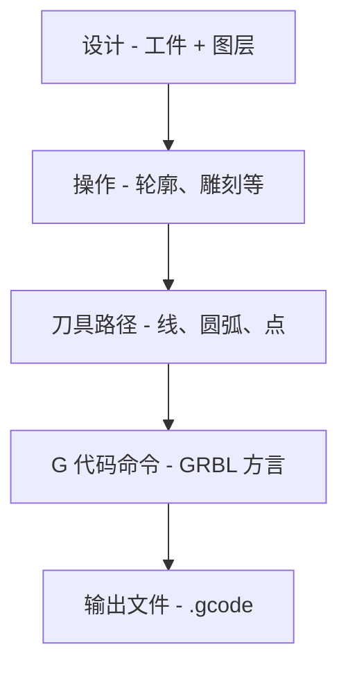

# G 代码基础

理解 G 代码有助于您排除故障和自定义 Rayforge 输出。

## 高级流程

Rayforge 通过多步骤过程将您的设计转换为 G 代码：



**Rayforge 做什么：**

1. **分析您的设计** - 从工件提取几何
2. **应用操作** - 确定切割/雕刻路径
3. **优化刀具路径** - 重新排序路径，最小化行程
4. **生成命令** - 将路径转换为 G 代码
5. **注入钩子** - 在指定点添加用户定义的宏
6. **写入文件** - 输出准备用于机器的完整 G 代码

## 简单示例

这是一个基本 G 代码文件结构，显示方形切割：

```gcode
G21 ;设置单位为毫米
G90 ;绝对定位
G54
T0
G0 X95.049 Y104.951 Z0.000
M4 S500
G1 X104.951 Y104.951 Z0.000 F3000
G1 X104.951 Y95.049 Z0.000 F3000
G1 X95.049 Y95.049 Z0.000 F3000
G1 X95.049 Y104.951 Z0.000 F3000
M5
G0 X95.000 Y105.000 Z0.000
M4 S500
G1 X95.000 Y95.000 Z0.000 F3000
G1 X105.000 Y95.000 Z0.000 F3000
G1 X105.000 Y105.000 Z0.000 F3000
G1 X95.000 Y105.000 Z0.000 F3000
M5
M5 ;确保激光关闭
G0 X0 Y0 ;返回原点
```

**关键命令：**

| 命令 | 描述               |
| ---- | ------------------ |
| `G21`| 毫米模式           |
| `G90`| 绝对定位           |
| `G54`| 选择工作坐标系 1   |
| `T0` | 选择工具 0（激光头）|
| `G0` | 快速移动（激光关闭）|
| `G1` | 切割移动（激光开启）|
| `M4` | 激光开（动态功率模式）|
| `M5` | 激光关             |
| `S500`| 设置激光功率为 500（0-1000 范围的 50%）|
| `F3000`| 设置进给率为 3000 mm/min |

---

## 相关页面

- [G 代码方言](../reference/gcode-dialects) - 固件差异
- [导出 G 代码](../files/exporting) - 导出设置和选项
- [钩子和宏](../machine/hooks-macros) - 自定义 G 代码注入
